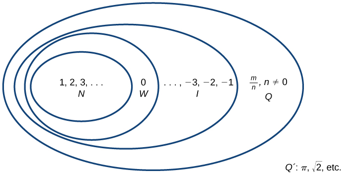

# Chapter 1: Prerequisites
## 1.1 Real Numbers: Algebra Essentials
- `natural numbers`: numbers used for counting/enumerating items. Can use set notation $\{1, 2, 3, ...\}$
- `whole numbers`: the set of natural numbers plus zero: $\{0, 1, 2, 3, ...\}$
- `integers`: add to the set of whole numbers the opposites of each number $\{..., -3, -2, -1, 0, 1, 2, 3, ...\}$
  - Three subsets of integers, negative integers, zero, and positive integers
- `rational numbers`: fractions (or quotients) containing integers in both the numerator and the denominator, and the denominator can never be zero
  - $\{\frac{m}{n} | m\space\text{and}\space n\space\text{are integers and}\space n \ne 0\}$
- `terminating decimal`: $\frac{15}{8} = 1.875$
- `repeating decimal`: $\frac{4}{11} = 0.36363636... \space0.\overline{36}$
- `irrational numbers`: numbers that cannot be written as a fraction of two integers
  - $\{h | h \space\text{is not a rational number}\}$
- `real numbers`: the set of both rational and irrational numbers
  - Similar to integers, these can be divided into sets of negative real numbers, zero, and positive real numbers
  - You can put these numbers on a number line
- 
  - N: the set of natural numbers
  - W: the set of whole numbers
  - I: the set of integers
  - Q: the set of rational numbers
  - Q': the set of irrational numbers
### Performing Calculations Using the Order of Operations
- Order of operations must be evaluated in a systematic order, typical acronym is **PEMDAS**
  - **P**(arenthesis)
  - **E**(xponents)
  - **M**(ultiplication) and **D**(ivision)
  - **A**(ddition) and **S**(ubtraction)
- For a mathematical expression, simplify it using order of operations
  - Step 1. Simplify any expression with grouping symbols
  - Step 2. Simplify any expressions containing exponents or radicals
  - Step 3. Perform any multiplication in order, from left to right
  - Step 4. Perform any addition and subtraction in order, from left to right
### Using Properties of Real Numbers
- **Commutative properties are associated with repositioning**
  - For example, $5 + 2 = 2 + 5$ and $5 \cdot 2 = 2 \cdot 5$
  - `commutative property of addition`: numbers may be added in any order without affecting the sum
  - `commutative property of multiplication`: numbers may be multiplied in any order without affecting the product
- **Associative properties refer to regrouping**
  - $5 + (2 + 3) = (5 + 2) + 3$ and $5 \cdot (2 \cdot 3) = (5 \cdot 2) \cdot 3$
  - Or $a(bc) = (ab)c$
  - `associative property of multiplication`: does not matter how we group numbers when multiplying
  - `associative property of addition`: numbers may be grouped differently without affecting the sum
- Distributive property combines addition and multiplication
  - `distributive property`: the product of a factor times a sum is the sum of the factor times each term in the sum
  - $a \cdot (b + c) = a \cdot b + a \cdot c$
  - Ex: $15(121) = 15(100 + 20 + 1) = 15 \cdot 100 + 15 \cdot 20 + 15 \cdot 1 = 1500 + 300 + 15 = 1815$
  - Ex: $a(b + c - d + e) = ab + ac - ad + ae$
- Identity properties
  - `identity property of addition`: states that there is a unique number, called "additive identity" (0), that, when added to a number, results in the original number
    - $a + 0 = a$
  - `identity property of multiplication`: states that there is a unique number, called "multiplicative identity" (1), that, when multiplied by a number, results in the original number
    - $a \cdot 1 = a$
- Inverse properties
  - `inverse property of addition`: for every real number, there is a unique number that when added to the original number results in the additive identity(opposite)
    - $a + (-a) = 0$
  - `inverse property of multiplication`: for all real numbers (except 0), there is a unique number, called the "multiplicative inverse" (reciprocal) that, when multiplied by the original number, results in the multiplicative identity (1)
    - $a \cdot \frac{1}{a} = 1$
    - $\frac{3}{5} \cdot \frac{5}{3} = 1$
    - This does not apply to zero because $\frac{1}{0}$ is undefined
- Expression versus equation
  - An expression is something that does not have a "solution", you can simplify or evaluate
  - An equation is something that is "solved", if a sentence has "is" in it, it is an equation
- Examples
  - $12x^3y^7 - 9x^4y^2 - 2x^8y^3 = 3x^3y^2(4y^5 - 3x - x^5y)$
  - $2\pi r(r + h) = 2\pi r^2 + 2\pi rh$
  - $2(L + W) = 2L + 2W$
  - $4y^3 + y = y(4y^2 + 1)$
  - $2x^2y^3 - 4xy + 6x^7y^9 = 2xy(xy^2 - 2 + 3x^6y^8)$
  - $3x + 6 = 3(x + 2)$
  - $3x + 7 = 5(\frac{3}{5}x + \frac{7}{5})$
  - $17xy + 13x^3w = 7z(\frac{17xy}{7z} + \frac{13x^3w}{7z})$
  - $12 - 2(3 - (6 - 5)^2 + (4 - 5)^3 - 2 \div(3-5)) = 12 - 2(3 - 1 - 1 + 1) = 12 - 4 = 8$
  - $5l \div 3l \times (9-6) = \frac{5l}{3l} \times 3 = \frac{5}{3} \cdot \frac{3}{1} = 5$
  - $-5 + 2(3 - (4 - 5)^3 - (3 - 4)^2 + 3 \div(4-1) = -5 + 2(3 - -1 - 1 + 3 \div3) = -5 + 2(3 + 1 - 1 + 1) = -5 + 2(4) = -5 + 8 = 3$
    - If $a > 0 then a^{even or odd} = positive$
    - If $a < 0 and a^{even} = positive$ if $a < 0 and a^{odd} = negative$
### 1.1 Section Exercises
- $10 + 2 \times (5 - 3)$
- $6 \div 2 - (81 \div 3^2)$
## 1.2 Exponents and Scientific Notation
- Exponents is a base multiplied by itself multiple times
- $a^n = n^{th}\space power \space of \space a = n^{th} \space degree \space of \space a$
  - $a$ is the base and $n$ is our exponent/degree
  - Ex. $5^3 = 5 \cdot 5 \cdot 5$
- Multiplication of exponents (**with the same base!**) means you add
  - Ex. $2^3 \cdot 2^4 = 2 \cdot 2 \cdot 2 \cdot 2 \cdot 2 \cdot 2 \cdot 2$
- Division of exponents (**with the same base**) means you subtract
  - Ex. $\frac{2^5}{2^3} = \frac{2 \cdot 2 \cdot 2 \cdot 2 \cdot 2}{2 \cdot 2 \cdot 2} = 2^2$
  - Ex. $\frac{2^7}{2^{11}} = \frac{1}{2^4}$
    - In this instance, where do you have the higher degree of an exponent? If the denominator, you can subtract the powers from each other, then take the reciprocal
    - Negative exponent switches position
    - $\frac{a^{-1}}{1} = \frac{1}{a^n}$
- Ex. $\frac{2^{-3} \cdot 5^4 \cdot 7^{-2} \cdot 11^5}{3^{-5} \cdot 19^2} = \frac{5^4 \cdot 11^5 \cdot 3^5}{2^3 \cdot 7^2 \cdot 19^2}$
  - Note how $2^{-3}$, $7^{-2}$, and $3^{-5}$ were flipped to obtain positive exponents
- Ex. $\frac{2^5 \cdot 3^7 \cdot 5 \cdot 7^{11}}{2^4 \cdot 3^9 \cdot 5^12 \cdot 7^3} = \frac{2^1 \cdot 7^8}{3^2 \cdot 5^{11}}$
- $(a^n)^m = a^{n \cdot m}$
  - Ex. $(2^3)^4 = (2^3)(2^3)(2^3)(2^3) = 2^{12}$
- $(a^n \cdot b^m)^k = a^{n \cdot k}b^{m \cdot k}$
  - Ex. $(2^3 \cdot 3^4)^2 = (2^3 \cdot 3^4)(2^3 \cdot 3^4) = 2^6 \cdot 3^8$
  - Ex. $(5x^3y^5z)^2 = 5^{1 \cdot 2}\cdot x^{3 \cdot 2} \cdot y^{5 \cdot 2} \cdot z^{2}$
- $\frac{a}{b}^n = \frac{a^n}{b^n}$
- $\frac{a^n}{b^m}^k = \frac{a^{nk}}{b^{mk}}$
- Examples
  - $(-x^5y^2z)^3 = -x^{15}y^6z^3$
    - Don't forget the negative...
  - $(-x^{-2}y^2z^{-1})^{-2} = \frac{1}{(-x^{-2}y^2z^{-1})^2} = \frac{1}{x^{-4}y^4z^{-2}} = \frac{x^4z^2}{y^4}$
    - Don't forget the negatives
  - $(-x^{-2}y^2z^{-1})^{-2} = (-1)^{-2}x^4y^{-4}z^2 = \frac{x^4z^2}{y^4}$
  - $(3x^{-2}y^{-5}z)^{-3} = \frac{1}{(3x^{-2}y^{-5}z)^{3}} = \frac{1}{3^3x^{-6}y^{-15}z^3} = \frac{x^6y^{15}}{27z^3}$
  - $(3x^{-2}y^{-5}z)^{-3} = 3^{-3}x^6y^{15}z^{-3} = \frac{x^6y^{15}}{27z^3}$
  - $(-2x^{-2}y^2z^{-1})^{-2} = (-2)^{-2}x^4y^{-4}z^2 = \frac{x^4z^2}{-2^2y^4} = \frac{x^4z^2}{4y^4}$
- Any number to the first power is the number itself
  - $a^1 = a$
  - Ex: $(4x)^{-1} = \frac{1}{4x}$
  - Ex: $4x^{-1} = \frac{4}{x}$
  - Ex: $3 \cdot 2^{-4} = \frac{3}{2^4}$
- Any number (except zero) to the zero power is 1
  - $a^0 = 1$
- Any number (except 0) to the -1 power is 1 over the number
  - $a^{-1} = \frac{1}{a}$
- $(\frac{5x^3y^{-2}z^{-4}}{2x^7y^5z^{-9}})^{-2} = (\frac{5x^{-4}y^{-7}z^{5}}{2})^{-2} = (\frac{5^{-2}x^8y^{14}z^{-10}}{2^{-2}}) = \frac{4 \cdot x^8 \cdot y^{14}}{25 \cdot z^{10}}$
  - First step for this problem is to combine exponents with similar bases
- $(-2x^{-3}y^4z^1x^5y^{-3})^2(\frac{-x^4y^3}{x^7}) = (-2x^2yz)^2(-x^{-3}y^3) = (-2^2x^4y^2z^2)(-x^{-3}y^3) = -4xy^5z^2$
### Section 1.2 Examples
- $9^2 = 9 \cdot 9 = 81$
- $15^{-2} = \frac{1}{15^2} = \frac{1}{225}$
- $3^2 \times 3^3 = 3^5$
- $5^{-2} \div 5^2 = \frac{1}{5^2 \cdot 5^2} = \frac{1}{625}$
- $4^2 \times 4^3 \div 4^{-4} = \frac{4^5}{4^{-4}} = 4^{5 -(-4)}=4^9$
- $(12^3 \times 12)^{10} = (12^4)^{10}=12^{40}$
- $(y^7)^3 \div x^{14} = \frac{y^{21}}{x^{14}}$
- $\sqrt[5]{2^5} = 2^{\frac{5}{7}}$
- $(\sqrt{x})^2 = x^{\frac{1}{2}} x^{\frac{1}{2}} = x^1 = x$
- $\frac{a^3a^2}{a} = \frac{a^5}{a} = a^4$
- $\frac{(16\sqrt{x})^2}{y^{-1}} = \frac{(16^2x)}{y^{-1}} = 256xy$
- $\frac{2^3}{(3a)^{-2}} = 8 \cdot 9 \cdot a^2$
- $(\frac{3^2}{a^2})^{-2}(\frac{a^4}{2^2})^2n = (\frac{a^3}{9})^2(\frac{a^4}{4})^2 = (\frac{a^6}{81})(\frac{a^8}{16}) = \frac{a^{14}}{81 \cdot 16}$
- $(6^2 - 24)^2 \div (\frac{x}{y})^{-5} = 12^2 \div (\frac{y}{x})^5 = 12^2 \div \frac{y^5}{x^5} = 144 \cdot \frac{x^5}{y^5}$
- $\frac{m^2n^3}{a^2c^{-3}} \cdot \frac{a^{-7}n^{-2}}{m^2c^4} = \frac{m^{2 - 2} \cdot n^3 \cdot a^{-7-2}}{c^{-3+4}} = \frac{n^1 \cdot a^{-9}}{c} = \frac{n}{ca^9}$

## 1.3 Radicals and Rational Exponents
#### Evaluating Square Roots
- When the square root of a number is squared, the result is the original number, such as $4^2 = 16$ so $\sqrt{16} = 4$. The square root function is the inverse of squaring a number
- Generally, if $a$ is a positive real number, then $\sqrt{a}$ is a number that, when multiplied by itself, gives $a$. The square root could be positive/negative, because multiplying two negative numbers gives a positive
- The **principal square root** is a non-negative number that when multiplied by itself equals $a$, the principal square root of $a$ is written as $\sqrt{a}$. The symbol $\sqrt{}$ is called a **radical**, the term under the symbol is the **radicand** and the entire expression is a **radical expression**
- Examples

---
In-Class notes
- In a square root, the symbol $\sqrt{}$ is the `radical`, the number under the radical is the `radicand`, and the entire expression is the `radical expression`
- If there is no number written, then there is an "invisible" two in the radical, ex. $\sqrt[2]{25}$
- In the example $\sqrt[n]{a^m}$
  - $n$ = index
  - $m$ = exponent
  - $a$ = base
  - $a^m$ = radicand
- $\sqrt{100} = 10$
- $\sqrt{\sqrt{16}} = \sqrt{4} = 2$
- $\sqrt{25 + 144} = \sqrt{169} = 13$
- $\sqrt{}$
- If a > 0 and b > 0, then $\sqrt{ab} = \sqrt{a} \cdot \sqrt{b}$
  - Similarly, $\sqrt[5]{a} \cdot \sqrt[5]{b} = \sqrt[5]{ab}$
- $\frac{\sqrt{234x^{11}y}}{\sqrt{26x7y}} = \sqrt{\frac{234x^{11}y}{26x^7y}} = \sqrt{\frac{117x^4}{13}} = \sqrt{9x^4} = 3x^2$
- $\sqrt{2} \cdot \sqrt{8} = \sqrt{2 \cdot 8} = \sqrt{16} = 4$
- $3\sqrt{17} + 2\sqrt{17} = 5\sqrt{17}$
  - Similar radicals can be combined (think of it as the same as $3x + 2x = 5x$)
- $\sqrt{5} + 6\sqrt{20}$
- $5\sqrt{2} + 3\sqrt{18} = 5\sqrt{2} + 3\sqrt{9 \cdot 2} = 5\sqrt{2} + 9\sqrt{2} = 14\sqrt{2}$
- $20\sqrt{72a^3b^4c} - 14\sqrt{8a^3b^4c} = 20\sqrt{36 \cdot 2 a^2 \cdot a^1 \cdot b^2 \cdot b^2 \cdot c} - 14\sqrt{4 \cdot 2 \cdot a^2 \cdot a \cdot b^2 \cdot b^2 \cdot c}$
  - $= 20 \cdot 6ab^2\sqrt{2ac} - 14 \cdot 2ab^2\sqrt{2ac} = 120ab^2\sqrt{2ac} - 28ab^2\sqrt{2ac} = 92ab^2\sqrt{2ac}$
- $\sqrt{a^4} = a^{\frac{4}{2}} = a^2$
- $\sqrt[3]{1000} = 10$
- This is an example of "not good technique" for simplifying square root expressions, very manual technique
  - $\sqrt{72a^7b^{11}c^5} = \sqrt{36 \cdot 2 \cdot a^2\cdot a^2\cdot a^2 \cdot a^1 \cdot b^2\cdot b^2\cdot b^2\cdot b^2\cdot b^2 \cdot b^1 \cdot c^2\cdot c^2 \cdot c^1} = 6aaabbbbbcc\sqrt{2abc} = 6a^3b^5c^2\sqrt{2abc}$
- This is an example of "good technique"
  1. Prime factorization of any numbers under the radicand
  2. Divide the exponents within the radical by the index of the radical
  3. Combine the results of refactoring
  - $\sqrt{72a^7b^{11}c^5} = \sqrt{2^3 \cdot 3^2a^7b^{11}c^5}$
    - Take the number under th radical and do prime factorization
      - ex. $72 = 2^3 \cdot 3^2$
    - Check the exponents of each prime factor
    - Divide the exponents within the radical by the index of the radical
      - $\sqrt{2^3} = 2\sqrt{2}$
      - $\sqrt{3^2} = 3$
      - $\sqrt{a^7} = a^3\sqrt{a}$
      - $\sqrt{b^{11}} = b^5\sqrt{b}$
      - $\sqrt{c^5} = c^2\sqrt{c}$
    - Combine the results of your refactoring
      - $6a^3b^5c^2\sqrt{2abc}$
    - Additional examples
      - $\sqrt[3]{a^5} = a\sqrt[3]{a^2}$
      - $\sqrt[5]{4a^4b^5c^6e^7d^8w^{13}p^{26}}$
        - Prime factorization
          - $\sqrt[5]{4} = 2 \cdot 2 = \sqrt[5]{2^2}$
        - Divide exponents by the index
          - $\sqrt[5]{a^4}$
          - $\sqrt[5]{b^5} = b$
          - $\sqrt[5]{c^6} = c\sqrt[5]{c}$
          - $\sqrt[5]{e^7} = e\sqrt[5]{e^2}$
          - $\sqrt[5]{d^8} = d\sqrt[5]{d^3}$
          - $\sqrt[5]{w^{13}} = w^2\sqrt[5]{w^3}$
          - $\sqrt[5]{p^{26}} = p^5\sqrt[5]{p}$
        - Combine
          - $bcedw^2p^5\sqrt[5]{2^2ce^2d^3w^3p}$
      - $\sqrt[3]{432a^7b^2c^{11}de^{15}} = \sqrt[3]{2^4 \cdot 3^3 \cdot a^7b^2c^{11}de^{15}}$
        - Prime factorization
          - $432 / 2 = 216$
            - $216 / 2 = 108$
              - $108 / 2 = 54$
                - $54 / 2 = 27$
                  - $27 / 3 = 9$
                    - $9 / 3 = 3$
          - result = $2^4 \cdot 3^3$
        - Divide exponents by the index
          - $\sqrt[3]{2^4} = 2\sqrt[3]{2}$
          - $\sqrt[3]{3^3} = 3$
          - $\sqrt[3]{a^7} = a^2\sqrt[3]{a}$
          - $\sqrt[3]{b^2} = \sqrt[3]{b^2}$
          - $\sqrt[3]{c^{11}} = c^3\sqrt[3]{c^2}$
          - $\sqrt[3]{d} = \sqrt[3]{d}$
          - $\sqrt[3]{e^{15}} = e^5$
        - Combine
          - $6a^2c^3e^5\sqrt[3]{2ab^2c^2d}$
- Can think of the square root as the opposite of squaring a number
  - $\sqrt{4} = 2$
  - You can however, have $-\sqrt{25} = -5$
- **PRINCIPAL SQUARE ROOT**
  - The principal square root of $a$ is the non-negative number that, when multiplied by itself, equals $a$
  - When we say $\sqrt{4}$, it is a number, and an expression, and it is only positive
    - This is different from when we say $x^2 = 4$, this is an equation and may have multiple answers
      - Ex. $x^2 = 4 = \pm2$
- **Under any square root (or any even root), the radicand must be positive**
  - You cannot say $\sqrt{-25}$, this is called "not real"
- **IMPORTANT RULE**
  - When dealing with even roots, you need to make sure that the radicand is positive, this is because the radicand could be positive or negative, so we agree that it is positive
  - $\sqrt{a^2} = |a|$
    - Absolute value indicates "distance" from zero
  - $\sqrt{(-2)^2} = |-2| = 2$
  - $\sqrt[2]{(-6)^2} = |-6| = 6$
  - $\sqrt[2]{a^{14}} = |a^7|$
  - When dealing with odd roots, you do not have the possibility of having two options
  - $\sqrt[3]{a^3}$
- Under even root, in order to continue, you must have positive radicands
### Examples
- For examples in the textbook, assume all variables are positive
- $(\frac{\sqrt{250x^2}}{\sqrt{100b^3}})(\frac{7\sqrt{b}}{\sqrt{125x}}) = \sqrt{\frac{250x^2}{100b^3}} \cdot \frac{7}{1} \cdot \sqrt{\frac{b}{125x}} = \sqrt{\frac{5x^2}{2b^3}} \cdot \frac{7}{1} \cdot \sqrt{\frac{b}{125x}} = 7 \cdot \sqrt{\frac{5 \cdot x^2}{2 \cdot b^3} \cdot \frac{6}{125x}} = 7 \cdot \sqrt{\frac{x}{2 \cdot b^2 \cdot 25}} = 7 \cdot \frac{\sqrt{x}}{5b\sqrt{2}} = \frac{7\sqrt{x}}{5b\sqrt{2}} = \frac{7\sqrt{2x}}{10b}$
  - Remember to rationalize denominator before you are done
- $\frac{15\sqrt[4]{125}}{\sqrt[4]{5}} = 15 \cdot \sqrt[4]{\frac{125}{5}} = 15 \cdot \sqrt[4]{25} = 15 \cdot \sqrt[4]{5^2} = 15\sqrt{5}$
- $3\sqrt[3]{-432} +\sqrt[3]{16} = 3\sqrt[3]{-2^4 \cdot 3^3}+\sqrt[3]{2^4} = -3 \cdot 2 \cdot 3 \cdot \sqrt[3]{2} + 2 \cdot \sqrt[3]{2} = -16\sqrt[3]{2}$
  - If you have a negative number under an odd index, the negative jumps out
  - 432 / 2
    - 216 / 2
      - 108 / 2
        - 54 / 2
          - 27 / 3
            - 9 / 3
              - 3
- $\sqrt{400x^4} = \sqrt{2^45^2x^4} = 2^2 \cdot 5 \cdot x^2 = 20x^2$
  - 400 / 2
    - 200 / 2
      - 100 / 2
        - 50 / 2
          - 25 / 5
            - 5
- $\sqrt{4y^2} = 2|y|$
- $\sqrt{49p} = 7\sqrt{p}$
- $(144p^2q^6)^{\frac{1}{2}} = \sqrt{144p^2q^6} = 12pq^3$ (if no assumption that all variables are positive then $12|p|q^3$)
- $m^{\frac{5}{2}}\sqrt{289} = \sqrt{m^5289} = 17m^2\sqrt{m}$
- $9\sqrt{3m^2} + \sqrt{27} = 9m\sqrt{3} + 3\sqrt{3}$
- $3\sqrt{ab^2} - b\sqrt{a} = 3b\sqrt{a} - b\sqrt{a} = 2b\sqrt{a}$
- $\frac{4\sqrt{2n}}{\sqrt{16n^4}} = \frac{4\sqrt{2n}}{4n^2} = \frac{\sqrt{2n}}{n^2}$
- $\sqrt{\frac{225x^3}{49x}} = \frac{15x}{7}$
- $3\sqrt{44z} + \sqrt{99z} = 3\sqrt{4\cdot11z} + \sqrt{9\cdot11z} = 3 \cdot 2 \sqrt{11z} + 3 \sqrt{11z} = 9\sqrt{11z}$
- $\frac{\sqrt{8}}{1-\sqrt{3x}} = \frac{\sqrt{8}}{\sqrt{3x}} \cdot \frac{\sqrt{3x}}{\sqrt{3x}} = \frac{2\sqrt{2}\cdot\sqrt{3x}}{3x} = \frac{2\sqrt{6x}}{3x}$
  - $\frac{1}{\sqrt{a} - \sqrt{b}} \cdot \frac{\sqrt{a} + \sqrt{b}}{\sqrt{a} + \sqrt{b}}$
- $\sqrt{\frac{20}{121d^4}} = \sqrt{\frac{4\cdot5}{11^2d^4}} = \frac{2\sqrt{5}}{11 \cdot d^2}$
- $\sqrt{\frac{20}{121d^3}} = \frac{\sqrt{4 \cdot 5}}{11 \cdot d \sqrt{d}} = \frac{2\sqrt{5d}}{11d \cdot d}$
## 1.4 Polynomials
### Identifying the Degree and Leading Coefficient of Polynomials
- **polynomial**: sum or difference of terms, with each term consisting of a variable raised to a non-negative integer power. **coefficient** is a number multiplied by a variable raised to an exponent (ex. $384\pi$). Coefficients can be positive/negative/zero and can be whole numbers/decimals/fractions. Each product is called a **term of a polynomial** and if it does not contain a variable, it is called a **constant**
- Polynomials with only one term are called **monomial** (such as $5x^4)$, two terms is a **binomial** (such as $2x - 9$), three terms is called a **trinomial** (such as $-3x^2 + 8x - 7$)
- The **degree** of a polynomial is the highest power of the variable that occurs in the polynomial, this is the **leading term** and is usually written first. The coefficient of the leading term is called the **leading coefficient**. *Standard form* for a polynomial is when it is written so that powers are descending
- A **polynomial** is an expression that can be written in the form $a_{n}x^n + ... + a_2x^2 + a_1x + a_0$
  - Each real term $a_i$ is called a **coefficient**
  - In this instance, $a_0$ is called a **constant** because it is not multiplied by a variable
  - Each product of $a_ix^i$ is a **term of a polynomial
  - The highest power that occurs across the polynomial is called the **degree**, the **leading term** is the term with the highest power, its coefficient is called the **leading coefficient**
- Example 1.a: $3 + 2x^2 - 4x^3$
  - Degree: $3$
  - Leading term: $-4x^3$
  - Leading coefficient: $-4$
- Example 1.b: $5t^5 - 2t^3 + 7t$
  - Degree: $5$
  - Leading term: $5t^5$
  - Leading coefficient: $5$
- Example 1.c: $6p - p^3 -2$
  - Degree: $3$
  - Leading term: $-p^3$
  - Leading coefficient: $-1$
- Example 1.1: $4x^2 - x^6 + 2x - 6$
  - Degree: $6$
  - Leading term: $-x^6$
  - Leading coefficient $-1$
### Adding and subtracting polynomials
- Polynomials can be added and subtracted by combining like terms (terms with the same variables raised to the same exponents)
  - Example: $5x^2$ and $-2x^2$ are like terms and can be combined to get $3x^2$, but $3x^2$ and $-2x^2$ are not like terms
- Example 2.1: $(12x^2 + 9x - 21) + (4x^3 + 8x^2 - 5x + 20)$
  - $4x^3 + 20x^2 + 4x - 1$
- Example 2.2: $(2x^3 + 5x^2 - x + 1) + (2x^2 - 3x - 4)$
  - $2x^3 + 7x^2 - 4x - 3$
- Example 3.1: $(7x^4 - x^2 + 6x + 1) - (5x^3 - 2x^2 + 3x + 2)$
  - $7x^4 - 5x^3 + x^2 + 3x - 1$
- Example 3.2: $(-7x^3 - 7x^2 + 6x - 2) - (4x^3 - 6x^2 - x + 7)$
  - $-11x^3 - x^2 + 7x - 9$
### Multiplying Polynomials
- When multiplying polynomials, must use the distributive property to multiply each term in the first polynomial by each term in the second
#### Multiplying polynomials using the Distributive property
- To multiply a polynomial by a number, distribute the number, for example $2(x + 7) = 2x + 14$. After multiplying, combine like terms and simplify.
- Example 4.1: $(2x + 1)(3x^2 - x + 4)$
  - $6x^3 - 2x^2 + 8x + 3x^2 - x + 4 = 6x^3 + x^2 + 7x + 4$
- Example 4.2: $(3x + 2)(x^3 - 4x^2 + 7)$
  - $3x^4 - 12x^3 + 21x + 2x^3 - 8x^2 + 14 = 3x^4 - 9x^3 - 8x^2 + 21x + 14$
##### Using FOIL to multiply binomials
- **FOIL: First Outer Inner Last**: sometimes used to find the product of two binomials
- Example 5.1: $(2x - 18)(3x + 3)$
  - First: $6x^2$ Outer: $6x$ Inner: $-54x$ Last: $-54$
  - $6x^2 - 48x - 54$
- Example 5.2: $(x + 7)(3x - 5)$
  - First: $3x^2$ Outer: $-5x$ Inner: $21x$ Last: $-35$
  - $3x^2 + 16x - 35$
##### Perfect Square Trinomials
- When a binomial is squared, the result is called a **perfect square trinomial**. The first term of the trinomial is the square of the first term and the last term is the square of the last term. The middle term is the double of the product of the two terms
- Examples
  - $(x + 5)^2 = x^2 + 10x + 25$
  - $(x - 3)^2 = x^2 - 6x + 9$
  - $(4x - 1)^2 = 16x^2 - 8x + 1$
- Example 6.1: $(3x - 8)^2$
  - $9x^2 - 48x + 64$
- Example 6.2: $(4x - 1)^2$
  - $16x^2 - 8x + 1$
##### Difference of Squares
- **Difference of squares** occurs when you multiply by another binomial with the same terms, but opposite signs, for example $(x + 1)(x - 1) = x^2 + 1x - 1x - 1 = x^2 - 1$. In this, the inner and outer terms cancel out, the result is the square of the first term minus the square of the last term
- Generic form: $(a + b)(a - b) = a^2 - b^2$
- Example 7.1: $(9x + 4)(9x - 4)$
  - $81x^2 - 16$
- Example 7.2: $(2x + 7)(2x - 7)$
  - $4x^2 - 49$
#### Performing Operations with Polynomials of Several Variables
- All the same rules for polynomials with one variable apply when considering polynomials with more than one variable
- Example 8.1: $(x + 4)(3x - 2y + 5)$
  - $3x^2 - 2xy + 5x + 12x - 8y + 20 = 3x^2 - 2xy + 17x - 8y + 20$
- Example 8.2: $(3x - 1)(2x + 7y - 9)$
  - $6x^2 + 21xy - 27x - 2x - 7y + 9 = 6x^2 + 21xy - 29x - 7y + 9$
## 1.5 Factoring Polynomials
#### Factoring the Greatest Common Factor of a Polynomial
- **Greatest common factor** of two numbers is the largest number that divides evenly into both numbers (ex: 4 is the GCF of 16 and 20). When factoring a polynomial expression, the first step should be to check for a GCF, in this instance, the largest polynomial that divides evenly into the polynomials
- Example 1.1: $6x^3y^3 + 45x^2y^2 + 21xy$
  - GCF of 6, 45, and 21 is 3
  - GCF of $x^3$, $x^2$, and $x$ is $x$ and GCF of $y^3$, $y^2$ and $y$ is $y$
    - Note that the GCF of a set of expressions in the form $x^n$ will always be the exponent of lowest degree
  - Determine what the GCF needs to be multiplied by to obtain each term of the polynomial
    - $3xy(2x^2y^2) = 6x^3y^3$
    - $3xy(15xy) = 45x^2y^2$
    - $3xy(7) = 21xy$
  - Finally, write the factored expression as a product of the GCF and sum of the terms
    - $3xy(2x^2y^2 + 15xy + 7)$
- Example 1.2: $x(b^2 - a) + 6(b^2 - a)$
  - $(b^2 - a)(x + 6)$
#### Factoring a Trinomial with Leading Coefficient 1
- You should always begin by looking for a GCF, but extracting the GCF is not the only way a polynomial can be factored
  - For example, $x^2 + 5x + 6$ can be refactored as $(x + 2)(x + 3)$
- Trinomials in the form of $x^2 + bx + c$ can be factored by finding two numbers with a product of $c$ and a sum of $b$
  - Example: $x^2 + 10x + 16$ can be factored using 2 and 8. Then it can be rewritten as $(x + 2)(x + 8)$
- Trinomials that cannot be factored as a product of binomials are said to be prime
- Example 2.1: $x^2 + 2x - 15$
  - $(x - 3)(x + 5)$
- Example 2.2: $x^2 - 7x + 6$
  - $(x - 6)(x - 1)$
#### Factoring by Grouping
- Trinomials with leading coefficients other than 1 are slightly more complicated, but can be factored by grouping by dividing the x term into the sum of two terms, factoring each portion of the expression, then factoring out the GCF of the entire expression
- Example: $2x^2 + 5x + 3 = 2x^2 + 2x + 3x + 3 = 2x(x + 1) + 3(x + 1) = (x + 1)(2x + 3)$
- To factor $ax^2 + bx + c$, find two numbers with a product of $ac$ and a sum of $b$. Use these numbers to divide the $x$ term into the sum of two terms, factor each portion of the expression separately, then factor out the GCF of the entire expression
- Example 3.1: $5x^2 + 7x - 6$
  - Find factors of $ac$, in this instance $5 \cdot -6 = -30$ that sum to 7. In this instance, these will be -3 and 10
  - $5x^2 - 3x + 10x - 6 = (5x^2 - 3x) + (10x - 6)$
  - $x(5x - 3) + 2(5x - 3)$
  - $(5x - 3)(x + 2)$
#### Factoring a Perfect Square Trinomial
- A perfect square trinomial is one that can be written as the square of a binomial
- First, you need to confirm that first and last term are perfect squares, the confirm the middle term is twice the product of $ab$, then write the factored form as $(a + b)^2$
- Example 4.1: $25x^2 + 20x + 4$
  - $25x^2$ is a perfect square of $5x$, and 4 is a perfect square of 2
  - Twice the product of $5x$ and $2$ ($10x$) is $20x$
  - Therefore, this trinomial is a perfect square trinomial
  - $(5x + 2)^2$
- Example 4.2: $49x^2 - 14x + 1$
  - $7x$ and $-1$
  - $7x \cdot -1 = -7x$ multiplied by 2 is $-14x$
  - $(7x - 1)^2$
#### Factoring a Difference of Squares
- A difference of squares is a perfect square subtracted from a perfect square. Remember that the difference of squares can be rewritten as factors containing the same terms, but with opposite signs (as the middle terms cancel each other out)
- Example form: $a^2 - b^2 = (a + b)(a - b)$
- Example 5.1: $9x^2 - 25$
  - $(3x + 5)(3x - 5)$
- Example 5.2: $81y^2 - 100$
  - $(9y + 10)(9y - 10)$
#### Factoring the Sum and Difference of Cubes
- The sum of cubes can be factored into a binomial and a trinomial
  - Example form: $a^3 + b^3 = (a + b)(a^2 - ab + b^2)$
- The difference of cubes can also be factored into a binomial and trinomial, but with different signs
  - Example form: $a^3 - b^3 = (a = b)(a^2 + ab + b^2)$
- You can use the acronym *SOAP* to remember the signs when factoring sum/difference of cubes
  - **SOAP**: **S**ame **O**pposite **A**lways **P**ositive
  - Example: $x^3 - 2^3 = (x - 2)(x^2 + 2x + 4)$
  - The sign on the first 2 is the *same* as the sign between $x^3 - x^3$, the sign of the $2x$ term is *opposite* the sign between $x^3 - 2^3$, the sign of the last term, 4, is *always positive*
- Example 6.1: $x^3 + 512$
  - $(x + 8)(x^2 - 8x + 64)$
- Example 6.2: $216a^3 + b^3$
  - $(6a + b)(36a^2 - 6ab + b^2)$
- Example 7.1: $8x^3 - 125$
  - $(2x - 5)(4x^2 + 10x + 25)$
- Example 7.2: $1000x^3 - 1$
  - $(10x - 1)(100x^2 + 10x + 1)$
#### Factoring Expressions with Fractional or Negative Exponents
- Expressions with fractional or negative exponents can be factored by pulling out a GCF. Look for the variable or exponent that is common to each term of the expression and pull out that variable or exponent raised to the lowest power. These follow the same factoring rules as integer exponents
  - For example, $2x^{\frac{1}{4}} + 5x^{\frac{3}{4}}$ can be factored by pulling out $x^{\frac{1}{4}}$ and then being rewritten as $x^{\frac{1}{4}}(2 + 5x^{\frac{1}{2}})$
- Example 8.1: $3x(x + 2)^{-\frac{1}{3}} + 4(x + 2)^{\frac{2}{3}}$
  - Factor out GCF $(x + 2)^{-\frac{1}{3}}(3x + 4(x + 2))$
  - Simplify $(x + 2)^{-\frac{1}{3}}(3x + 4x + 8)$
  - $(x + 2)^{-\frac{1}{3}}(7x + 8)$
- Example 8.2: $2(5a - 1)^{\frac{3}{4}} + 7a(5a - 1)^{-\frac{1}{4}}$
  - Factor out GCF $(5a - 1)^{-\frac{1}{4}}(2 + 7a(5a - 1))$
  - $(5a - 1)^{-\frac{1}{4}}(2 + 7a)$
## 1.6 Rational Expressions