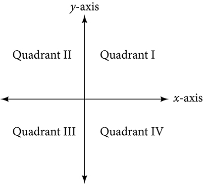
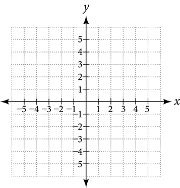

## 2.1: The Rectangular Coordinate Systems and Graphs
### Plotting Ordered Pairs in the Cartesian Coordinate System
- **Cartesian coordinate system**: a grid system having perpendicular axes, with the horizontal axis as the **x-axis** and the vertical axis as the **y-axis**. These two axes divide the plane into four sections, or quadrants. The center of the plan is where the two axes cross and is called the **origin** and is referred to as the point $(0, 0)$. These axes extend to positive and negative infinity and are numbered in equal units
- 
- 
- Each point on the plane can be described by its **x-coordinate** and its **y-coordinate**, which are together written as an ordered pair/coordinate pair, always in the form of $(x, y)$. This coordinate system is primarily a means of showing the relationship between two quantities
##### Overview
- **Cartesian Coordinate System**
  - A two-dimensional plane where the x-axis is the horizontal axis and the y-axis is the vertical axis
  - A point in the plane is defined as an ordered pair (x, y), such that x is determined by its horizontal distance from the origin and y is determined by its vertical distance from the origin
##### Examples
- Example: Plot the points (-2, 4), (3, 3), and (0, -3) in the plane
```python
import matplotlib.pyplot as plt
points = [(-2, 4), (3, 3), (0, -3)]
x_coords, y_coords = zip(*points)
plt.figure(figsize=(8, 8))
plt.xlim(-5, 5)
plt.ylim(-5, 5)
plt.axhline(y=0, color='k', linestyle='-', alpha=0.3)
plt.axvline(x=0, color='k', linestyle='-', alpha=0.3)
plt.grid(True, alpha=0.3)
plt.scatter(x_coords, y_coords, color='blue', s=100, zorder=5)
for i, (x, y) in enumerate(points):
    plt.annotate(f"({x}, {y})", (x, y), xytext=(x+0.2, y+0.2), fontsize=12)
    
plt.title("Example: Points in a Rectangular Coordinate System", fontsize=14)
plt.xlabel("x-axis", fontsize=12)
plt.ylabel("y-axis", fontsize=12)
plt.axis("equal")
plt.tight_layout()
plt.show()
```
### Graphing Equations by Plotting Points
- A set of points can be plotted to represent an equation, if this equation contains both an x and a y variable, it is called an **equation in two variables**, with its graph being called a **graph in two variables**. If we want to graph an equation, such as $y = 2x - 1$, we can begin by substituting values for x and then solving for y. We need to identify at least two points to graph a line
  - Example: $y = 2(3) - 1 = 5$ so our point is $(3, 5)$
##### How To
- **Given an equation, graph by plotting points**
  1. Make a table with one column labeled x, a second column labeled with the equation, and a third column listing the resulting ordered pairs
  2. Enter x-values down the first column using positive and negative values. Selecting the x-values in numerical order with make the graphing simpler
  3. Select x-values that will yield y-values with little effort, preferably ones that can be calculated mentally
  4. Plot the ordered pairs
  5. Connect the points if they form a line
##### Examples
- Graph the equation $y = -x + 1$ by plotting points
```python
import matplotlib.pyplot as plt
import numpy as np
# np.linspace() is used to return evenly spaced numbers over a specified interval
# https://numpy.org/doc/stable/reference/generated/numpy.linspace.html
# np.linspace(start, stop, num)
x_eq = np.linspace(-5, 5, 100)
y_eq = -x_eq + 1
plt.figure(figsize=(8, 8))
plt.xlim(-5, 5)
plt.ylim(-5, 5)
plt.axhline(y=0, color='k', linestyle='-', alpha=0.3)
plt.axvline(x=0, color='k', linestyle='-', alpha=0.3)
plt.grid(True, alpha=0.3)
plt.plot(x_eq, y_eq, 'r-', label='y = -x + 1', zorder=4)

plt.title("Example: Line in a Rectangular Coordinate System", fontsize=14)
plt.legend()
plt.xlabel("x-axis", fontsize=12)
plt.ylabel("y-axis", fontsize=12)
plt.axis('equal')
plt.tight_layout()
plt.show()
```
### Graphing Equations with a Graphing Utility
- *not used in this class*
### Finding x-intercepts and y-intercepts
- The **intercepts** of a graph are the point at which the graph crosses the axes. The **x-intercept** is the point where the graph crosses the x-axis (y-coordinate = 0) and the **y-intercept** is when the graph crosses the y-axis (x-coordinate = 0)
- To determine the x-intercept, set $y = 0$ and solve for x. Similarly, to determine the y-intercept, set $x = 0$ and solve for y.
- For example, if you have $y = 3x - 1$, set $y = 0$ and solve for x, so $0 = 3(x) - 1$
  - $1 = 3x$
  - $\frac{1}{3} = x$
- To find the y-intercept, set $x = 0$, so $y = 3(0) - 1$
  - $y = -1$
##### Overview
- **Given an equation, find the intercepts**
  - Find the x-intercept by setting $y = 0$ and solving for x
  - Find the y-intercept by setting $x = 0$ and solving for y
##### Example
- Find the intercepts of the equation $y = -3x - 4$
  - $0 = -3x - 4$
  - $4 = -3x$
  - $-\frac{4}{3} = x$
  - $y = -3(0) - 4$
  - $y = -4$
### Using the Distance Formula
- Derived from the Pythagorean Theorem, the **distance formula is used to find the distance between two points on a plane. This formula, $a^2 + b^2 = c^2$, is based on right triangles, where $c$ is the hypotenuse
- The distance formula is $\sqrt{(x_2 - x_1)^2 + (y_2 - y_1)^2}$
##### Overview
- **The Distance Formula**
  - Given endpoints $(x_1, y_1)$ and $(x_2, y_2)$, the distance between the two points is given by
    - $\sqrt{(x_2 - x_1)^2 + (y_2 - y_1)^2}$
##### Examples
- Find the distance between the points (-3, -1) and (2, 3)
  - $\sqrt{(2 - (-3))^2 + (3 - (-1))^2}$
  - $\sqrt{25 + 16}$
  - $\sqrt{41}$
### Using the Midpoint Formula
- When the endpoints of a line segment are known, we can find the point midway between them using the **midpoint formula**
- $M = (\frac{x_1 + x_2}{2}, \frac{y_1 + y_2}{2})$

---
In-class notes
#### Linear Functions
- Function means there is a relationship between x and y (x, y)
- x is our input, y is our output
- Not all x and y are called "functions"
- x is the independent variable and is your "run" (horizontal axis)
- y is the dependent variable and is your "rise" (vertical axis)
- Any set of (x, y) gives you a relation, but not all of them give you a function
- A function should have one and only one output for x
  - "For any given x, there should only be one y"
  - A vertical line **is not** a function, but it is a line
    - For a vertical line, the slope is "undefined"
    - For a horizontal line, the slope is zero, because it is flat
- For "linear" functions, the only thing you can do with it is add, subtract, divide, multiply
- These can be written in three forms
  - $y = mx + b$: "slope-y-intercept"
    - $m$ = slope: change in y over change in x, sometimes also referred to as "rise over run" = $\frac{y_2 - y_1}{x_2 - x_1}$ = $\frac{y_1 - y_2}{x_1 - x_2}$
    - $b$ = y-intercept, (0, $b$), $b$ is a number where you intersect the y-axis
    - Example: $y = -\frac{2}{3}x + 1$
      - $b = 1$, $y = (0, 1)$, $m = \frac{-2}{3}$
  - $y - y_1 = m(x - x_1)$: "slope-point"
    - $m = \frac{rise}{run}$, $(x_1, y_1)$ -> starting point, point on the line
    - Example: $y - 3 = 5(x + 2)$
      - In this example, you can pull $y_1 = 3$ and $x_1 = -2$
      - To find the y intercept, isolate $y = 5x + 13$
    - **THIS IS THE MOST IMPORTANT FORM OF A LINEAR FUNCTION**
  - $ax + by = c$: "standard form"
    - This does not give you the x-intercept or y-intercept
    - When you see x and y on the same side and some other number on the other side, use the "tic tac toe" method.
      - In the equation, replace x with 0 to get y, $3(0) + 2y = 6$, y = 3
      - In the equation, replace y with 0 to get x, $3x + 2(0) = 6$, x = 2
    - Example: $3x + 2y = 6$
      - a = 3, b = 2, c = 6
    - Need to be able to calculate the slope, "rise over run", so in this instance -3/2
      - Need to remember that if we are sloping downward, the slope is negative
    - To find the slope without graphing, isolate and solve for y
      - $3x + 2y = 6$
      - $2y = -3x + 6$
      - $y = \frac{-3}{2}x + 3$
    - Standard Form is the least important/popular form of the function
#### Distance formula
- If you have point $A(x1, y1)$ and point $B(x2, y2)$
  - $d(AB) = \sqrt{(x_1 - x_2)^2 + (y_1 - y_2)^2}$
  - Similar to the Pythagorean theorem, $a^2 + b^2 = c^2$, c is the hypotenuse
    - $a = y_1 - y_2$
    - $b = x_1 - x_2$
    - $c = \sqrt{(x_1 - x_2)^2 + (y_1 - y_2)^2}$
  - It does not matter if you subtract $x_1$ from $x_2$ or the other way around, because you are squaring the differences
- If you have point $A(x1, y1)$ and point $B(x2, y2)$ and want to find the midpoint
  - You can use $(x_1 + x_2) / 2$ and $(y_1 + y_2) / 2$, these will be your x and y coordinates of the midpoint
- Example, A = (-2, 7) and B = (3, -10)
  - distance = $\sqrt{(-2 - 3)^2 + (7 - (-10))^2} = \sqrt{314}$
  - $x = (-2 + 3) / 2 = \frac{1}{2}$
  - $y = (7 + -10) / 2 = \frac{-3}{2}$
  - midpoint = ($\frac{1}{2}, \frac{-3}{2}$)
- Example: $y = \frac{-3x + 5}{7} = \frac{-3}{7}x + \frac{5}{7}$
  - $m = \frac{-3}{7}$
  - $b = \frac{5}{7}$

#### Parallel and Perpendicular Lines
- Two lines are parallel when they **NEVER** intersect each other. These are lines that have the exact same slope, but can have different y-intercepts. If the y-intercept is the same, we can say they are the same line
- Perpendicular lines are those that meet at a 90-degree angle and have slopes that are negative reciprocals. For example, for the line $y = \frac{5}{2}$ then the perpendicular line would be $y = -\frac{2}{5}$
  - $m = \frac{a}{b}$ then the perpendicular line has a slope of $m = -\frac{b}{a}$
- When speaking about parallel and perpendicular lines, you need to be careful when speaking about the slope
  - For example, if you have a flat line, with a slope of `0`, you cannot have a reciprocal of $\frac{1}{0}$, so the slope of the perpendicular line is undefined

#### Examples
- $3x - 5 = 7$
  - $3x = 7 + 5$
  - $x = \frac{12}{3}$
  - $x = 4$
- $x - 5 = \frac{3}{7}$
  - $x = 5 + \frac{3}{7}$
  - $x = 5\frac{3}{7}$
- $5 - x = \frac{2}{3}$
  - $-x = \frac{2}{3} - 5$
  - $x = -\frac{2}{3} + 5$
  - $x = 4\frac{1}{3}$
- $7x + 2 = 3x - 9$
  - $7x - 3x + 2 = -9$
  - $4x = -9 - 2$
  - $4x = -11$
  - $x = \frac{-11}{4}$
- $3(x + 2) - 12 = 5(x + 1)$
  - $3x + 6 - 12 = 5x + 5$
- $12 - 5(x + 3) = 2x - 5$
  - $12 - 5x -15 = 2x - 5$
  - $12 -5x - 15 = 2x - 5$
  - $-3 - 5x = 2x - 5$
  - $-7x = -2$
  - $x = \frac{2}{7}$
- $\frac{1}{2} - \frac{1}{3} = \frac{4}{3}$
  - In this instance, start by finding the lowest common denominator (6)
  - $3 - 2x = 8$
- $\frac{1}{2}x + \frac{1}{3}(x + 2) - 4x = \frac{1}{5}(x - 3) - 2$
  - Lowest common denominator: 30
    - When the numbers are prime, just multiply them all together, so $2 \cdot 3 \cdot 5 = 30$
  - $15x + 10(x + 2) - 120x = 6(x - 3) - 60$
  - $15x + 10x + 20 - 120x = 6x - 18 - 60$
  - $-95x + 20 = 6x - 78$
  - $-101x = -98$
  - $x = \frac{98}{101}$
- $\frac{5}{x + 1} + \frac{1}{x - 3} = \frac{-6}{x^2-2x-3}$
  - Need to multiply by the common denominator, but need to factor first
  - When you have an equation, you want to get rid of the denominators
