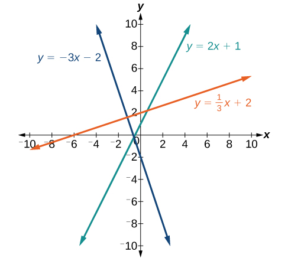

## 2.2: Linear Equations in One Variable
### Solving Linear Equations in One Variable
- A **linear equation** is an equation of a straight line, written in one variable (the only power of the variable is 1), and may take the form $ax + b = 0$. These are solved using basic algebraic operations
- Linear equations in one variable can be classified as one of three types, identity, conditional, or inconsistent. The **solution set** for an equation is all values that make the equation true. 
- An $identity equation$ is true for all values of the variable
  - Example: $3x = 2x + x$
  - For identity equations, the solution set is the set of all real numbers
- A **conditional equation** is true only for some values of the variable
  - Example: $5x + 2 = 3x - 6$
  - The solution set for this equation is only one number, -4
- An **inconsistent equation** results in a false statement
  - For these equations, there is no solution
##### Linear equation in one variable
- A linear equation in one variable can be written in the form $ax + b = 0$, where a and b are real numbers and $a \ne 0$
##### Examples
- $2x + 7 = 19$
  - $2x = 12$
  - $x = 6$
### Solving a Rational Equation
- If an equation contains at least one rational expression, it is considered a **rational equation**. Rational numbers are ratios of two numbers, think $\frac{2}{3}$. A rational expression is the ratio, or quotient of two polynomials
- Rational equations have a variable in the denominator in a least one of the terms, we want to move the variables to the numerator. One way to do this is to multiply both sides by the least common denominator (LCD).
  - To find the LCD, we identify an expression that contains the highest power of all the factors in all the denominators.
- Example: $\frac{7}{2x} - \frac{5}{3x} = \frac{22}{3}$
  - The LCD must contain $2x$, $3x$, and $3$, the LCD $6x$ contains all of these.
  - Multiply each side by the LCD: $(6x)(\frac{7}{2x} - \frac{5}{3x}) = (\frac{22}{3})(6x)$
  - Distributive property: $(6x)(\frac{7}{2x}) - (6x)(\frac{5}{3x}) = (\frac{22}{3})(6x)$
  - Cancel common factors: $(3)(7) - (2)(5) = (22)(2x)$
  - $21 - 10 = 44x$
  - $x = \frac{11}{44}$
  - $x = \frac{1}{4}$
- Always consider a binomial (such as $x - 1$) as an individual factor, it cannot be separated
  - An example are three denominators of $x$, $x - 1$, and $3x - 3$. First factor all denominators
  - $x$, $(x - 1)$, and $3(x - 1)$
  - Multiply together $x$, $(x - 1)$, and $3$ = $3x(x - 1)$
- Any solution that makes a denominator in the original expression equal zero must be excluded from the possibilities
##### Rational Equations
- A **rational equation** contains at least one rational expression where the variable appears in at least one of the denominators
##### How To
- Given a rational equation, solve it
  1. Factor all denominators in the equation
  2. Find and exclude values that set each denominator equal to zero
  3. Find the LCD
  4. Multiply the whole equation by the LCD. If the LCD is correct, there will be no denominators left.
  5. Solve the remaining equation
  6. Make sure to check solutions back in the original equations to avoid a solution producing zero in a denominator
#### Examples
- $\frac{2}{x} - \frac{3}{2} = \frac{7}{2x}$
  - Find LCD: $2x$
  - Multiply by LCD: $(2x)(\frac{2}{x}) - (2x)(\frac{3}{2}) = (\frac{7}{2x})(2x)$
  - $(2)(2) - (3x) = 7$
  - $4 - 3x = 7$
  - $-3x = 3$
  - $x = -1$
- $\frac{2}{3x} = \frac{1}{4} - \frac{1}{6x}$
  - Find LCD: $12x$
  - Multiply by LCD: $(12x)(\frac{2}{3x}) = (12x)(\frac{1}{4}) - (12x)(\frac{1}{6x})$
  - $(4)(2) = (3x)(1) - (2)(1)$
  - $3x - 2 = 8$
  - $x = \frac{10}{3}$
- $\frac{1}{x} = \frac{1}{10} - \frac{3}{4x}$

### Finding a Linear Equation
- Most familiar form of a linear equation is slope-intercept form, which is $y = mx + b$, where $m = \text{slope}$ and $b = \text{y-intercept}$.
#### The Slope of a Line
- The **slope** of a line refers to the ratio of the vertical change in $y$ over the horizontal change in $x$ between any two points of the line. This indicates the direction in which a line slants, as well as its steepness. This is often described as "rise over run"
- $m = \frac{y_2 - y_1}{x_2 - x_1}$
  - Note that it does not matter which point we call $(x_1, y_1)$ or $(x_2, y_2)$, as long as we are consistent we will get the same result
- If the slope is positive, the line slants to the right, if it is negative, it slants to the left. As slope increases, the line becomes steeper
- 
##### The Slope of a Line
- The slope of a line, $m$, represents the change in $y$ over the change in $x$. Given two points, $(x_1, y_1)$ and $(x_2, y_2)$, the following formula determines the slope of a line containing these two points
  - $m = \frac{y_2 - y_1}{x_2 - x_1}$
#### Examples
- Find the slope of a line for $(2, -1)$ and $(-5, 3)$
  - $m = \frac{3 - (-1)}{-5 - 2}$
  - $m = -\frac{4}{7}$
- Find the slope of a line for $(-2, 6)$ and $(1, 4)$
  - $m = \frac{4 - 6}{1 - (-2)}$
  - $m = -\frac{2}{3}$
- Identify the slope and y-intercept of a line given an equation
  - $y = -\frac{3}{4}x - 4$
  - $m = -\frac{3}{4}$
  - $\text{y-intercept} = (0, -4)$
#### The Point-Slope Formula
- Given the slope and one point on a line, we can find the equation of the line using point-slope formula
- $y - y_1 = m(x - x_1)$
- After substituting the slope and coordinates of one point, we simplify and write it in slope-intercept form
##### The Point-Slope Formula
- Given one point and the slope, the point-slope formula will lead to the equation of a line
- $y - y_1 = m(x - x_1)$
#### Examples
- $m = -3$ and passing through $(4, 8)$
  - $y - 8 = -3(x - 4)$
  - $y = -3x + 20$
- $m = 4$ and passing through $(2, 5)$
  - $y - 5 = 4(x - 2)$
  - $y = 4x - 3$
- passing through $(3, 4)$ and $(0, -3)$
  - $m = \frac{-3 - 4}{0 - 3} = \frac{7}{3}$
  - $y - 4 = \frac{7}{3}(x - 3)$
  - $y = \frac{7}{3}x - 3$
#### Standard Form of a Line
- Another way to write the equation of a line is in standard form, which is $ax + by = c$, where a, b, and c are integers
#### Vertical and Horizontal Lines
- Equations of vertical and horizontal lines do not require any of the preceding formulas
- Vertical line: $x = c$ where $c$ is a constant
  - The slope of a vertical line is undefined and regardless of the y-value at any point, the x-coordinate will be $c$
- Horizontal line: $y = c$ where $c$ is a constant
  - The slope of a horizontal line is zero and regardless of the x-value at any point, the y-coordinate will be $c$
- 
### Determining Whether Graphs of Lines are Parallel or Perpendicular
- Parallel lines have the same slope and different y-intercepts, these lines will never intersect
- 
- Perpendicular lines intersect to form a 90 degree angle. The slope of one line is the negative reciprocal of the other
  - If $m_1 = 2$ then $m_2 = -\frac{1}{2}$
- 
### Writing the Equations of Lines Parallel or Perpendicular to a Given Line
- To write the equation of a line parallel or perpendicular to another line, we follow the same principles as we do for finding any line. After find the slope, use point-slope formula to write the equation of the new line
##### How To
- Given an equation for a line, write the equation of a line parallel or perpendicular to it.
  1. Find the slope of the given line. The easiest way to do this is to write the equation in slope-intercept form.
  2. Use the slope and the given point with the point-slope formula
  3. Simplify the line to slope-intercept form and compare the equation to the given line

---
In-class notes
#### Examples
- Given two points, **write the equation of the line** passing through these points $(5, 4)$ and $(-1, 0)$
  - Write the template of the equation for a line
    - $y - y_1 = m(x - x_1)$
  - Find what you have in the equation
    - Choose the point that has zero in it as your $(x_1, y_1)$ point
      - In this example $x_1 = -1,\space y_1=0, x_2=5, \space y_2 = 4$
    - Calculate the slope (from our first example above): $\frac{0 - 4}{-1 -5} = \frac{-4}{-6} = \frac{2}{3}$
    - Now that we have the slope, we can plug in the rest of the numbers
      - $y - 0 = \frac{2}{3}(x - (-1))$
      - $y = \frac{2}{3}(x + 1)$
      - $y = \frac{2}{3}x + \frac{2}{3}$
- **Write the equation of a line** passing through $(5, 7)$ and having y-int of $(0, 3)$
  - $y - y_1 = m(x - x_1)$
  - $m = \frac{3 - 7}{0 - 5} = \frac{-4}{-5} = \frac{4}{5}$
  - $x_1 = 5, y_1 = 7$ and $x_2 = 0, y_2 = 3$
  - $y - 3 = \frac{4}{5}(x - 0)$
    - distribute and simplify
    - $y = \frac{4}{5}x + 3$
  - In this instance, we have the y-intercept explicitly listed, so we could use $y = mx + b$
- **Write the equation of a line** passing through $(5, 2)$ and having x-int of $(2, 0)$
  - $y - y_1 = m(x - x_1)$
  - $m = \frac{2 - 0}{5 - 2} = \frac{2}{3}$
  - $y = \frac{2}{3}(x - 2)$
  - $y = \frac{2}{3}x - \frac{4}{3}$
- **Write the equation of a line** passing through $(2, 5)$ and parallel (perpendicular) to the given line $2x - 3y = 6$
  - $y - y_1 = m(x - x_1)$
  - Set y equal to zero to get the x-intercept $2x - 3(0) = 6$
    - $2x = 6$
    - $x = 3$
    - X-intercept = $(3, 0)$
  - Set x equal to zero to get the y-intercept $2(0) - 3y = 6$
    - Y-intercept = $(0, -2)$
  - Find the slope of the given line
    - $m = \frac{2}{3}$
  - Parallel line has the same slope and a given point of $(2, 5)$
    - $y - 5 = \frac{2}{3}(x - 2)$
    - $y = \frac{2}{3}x - \frac{11}{3}$
  - For perpendicular line, the slope is the negative reciprocal
    - $m = -\frac{3}{2}$
    - $y - 5 = -\frac{3}{2}(x - 2)$
      - $y - 5 = -\frac{3}{2}x + 3$
      - $y = -\frac{3}{2} + 8$

- Need to be able to chose which form of the linear equation makes sense for the problem
  - $y = mx + b$
  - $y_2 - y_1 = m(x_2 - x_1)$ - go with this one
  - $ax + by = c$
  - $m = \frac{y_1 - y_2}{x_1 - x_2} = \frac{y_2 - y_1}{x_2 - x_1}$

- Write the equation of the line passing through these two points $(1, 3)$ and $(5, 5)$
  - $y - y_1 = m(x - x_1)$
  - $y - 3 = m(x - 1)$
  - $m = \frac{y_1 - y_2}{x_1 - x_2}$
    - $m = \frac{3 - 5}{1 - 5}$
    - $m = \frac{-2}{-4} = \frac{1}{2}$
  - $y - 3 = \frac{1}{2}x - \frac{1}{2}$
  - $y = \frac{1}{2}x + \frac{5}{2}$
- Write the equation of a line parallel to $y = 2x + 5$ and passes through the point $(4, 3)$
  - To find `m`, use the equation of the given line and isolate `y` in it. Whatever appears next to `x` is your slope. In this problem, we can already see the slope is 2
  - $m = 2$
  - $y - y_1 = m(x - x_1)$
    - $y - 3 = 2(x - 4)$
    - $y - 3 = 2x - 8$
    - $y = 2x - 5$
- Write the equation of a line perpendicular to $3y = x - 4$ and passes through the point $(-2, 1)$
  - $y - y_1 = m(x - x_1)$
    - $y - 1 = m(x - (-2))$
    - $y = -3x - 5$
  - To find slope, use the given equation and isolate `y`
    - $y = \frac{1}{3}x - \frac{4}{3}$
    - $m = \frac{1}{3}$
- Write the equation of a line where the line passes through $(-2, 0)$ and $(-2, 5)$
  - Because both x values are the same, the line is vertical
  - The slope is undefined, so $x = -2$
- Write the equation of a line where the line passes through $(1, 7)$ and $(3, 7)$
  - Because both y values are the same, the line is horizontal
  - The slope is zero
  - $y = 7$
- Write the equation of a line where the slope is undefined and passes through the point $(2, 3)$
  - Slope of the line is undefined, so the line is vertical
  - $x = 2$
- Write the equation of a line where the slope is zero and passes through the point $(1, -4)$
  - $m = 0$
  - $y = -4$