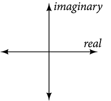

## 2.4: Complex Numbers
### Expressing Square Roots of Negative Numbers as Multiples of $i$
- If the value under a radicand is negative, the root is said to be an imaginary number. The imaginary number $i$ is the square root of -1
  - $\sqrt{-1} = i$
- Using the properties of radicals...
  - $i^2 = (\sqrt{-1})^2 = -1$
- We can write the square root of any negative number as a multiple of $i$, for example $\sqrt{-49}$
  - $\sqrt{-49} = \sqrt{49 \cdot (-1)} = \sqrt{49}\sqrt{-1} = 7i$
- A complex number is the sum of a real number and an imaginary number, it is expressed in standard form when it is written as $a + bi$ where $a$ is the real part and $b$ is the imaginary part. An example is $5 + 2i$
- Squaring an imaginary number produces a negative real number
##### Imaginary and Complex Numbers
- A **complex number** is a number in the form of $a + bi$ where
  - $a$ is the real part of the complex number
  - $b$ is the imaginary part of the complex number
- If $b = 0$, then $a + bi$ is a real number. If $a = 0$ and $b$ is not equal to 0, the complex number is called a pure imaginary number. An **imaginary number** is an even root of a negative number
##### How To
- Given an imaginary number, express it in the standard form of a complex number
  1. Write $\sqrt{-a}$ as $\sqrt{a}\sqrt{-1}$
  2. Express $\sqrt{-1} as $i$
  3. Write $\sqrt{a} \cdot i$ in simplest form
#### Examples
- Express $\sqrt{-9}$ in standard form
  - $\sqrt{9}\sqrt{-1} = 3i = 0 + 3i$
- Express $\sqrt{-24}$ in standard form
  - $\sqrt{24}\sqrt{-1} = \sqrt{2 \cdot 2 \cdot 6}i = 0 + 2i\sqrt{6}$
### Plotting a Complex Number on the Complex Plane
- You cannot plot complex numbers in the same way that you would real numbers, but they can still be represented graphically. To do so, we need to address two components of the number, using a **complex plane** which is a coordinate system where the horizontal axis represents the real component and the vertical axis represents the imaginary component. So the point $(a, b)$, where $a$ represents the real component and $b$ represents the imaginary component, can be easily graphed
##### Complex Plane
- In the complex plane, the horizontal axis is the real axis, and the vertical axis is the imaginary axis.
- 
#### How To
- Given a complex number, represent its components on the complex plane
  1. Determine the real part and the imaginary part of the complex number
  2. Move along the horizontal axis to show the real part of the number
  3. Move parallel to the vertical axis to show the imaginary part of the number
  4. Plot the point

### Adding and Subtracting Complex Numbers
- Like real numbers, we can perform arithmetic operations on complex numbers. To add or subtract, we combine the real parts and then combine the imaginary parts
##### Complex Numbers: Addition and Subtraction
- Adding complex numbers
  - $(a + bi) + (c + di) = (a + c) + (b + d)i$
- Subtracting complex numbers
  - $(a + bi) - (c + di) = (a - c) + (b - d)i$
#### How To
- Given two complex numbers, find the sum or difference
  1. Identify the real and imaginary parts of each number
  2. Add or subtract the real parts
  3. Add or subtract the imaginary parts
#### Examples
- $(3 - 4i) + (2 + 5i) = (5 + i)$
- $(-5 + 7i) - (-11 + 2i) = (6 + 5i)$

### Multiplying Complex Numbers
- Multiplying complex numbers is very similar to multiplying binomials, just work with the real and imaginary parts separately
#### Multiplying a Complex Number by a Real Number
- Distribute the real number just as you would with a binomial
- Example: $3(6 + 2i) = (3\cdot6) + (3\cdot2i) = 18 + 6i$
#### How To
- Given a complex number and a real number, multiply to find the product
  1. Use the distributive property
  2. Simplify
#### Examples
- $4(2 + 5i) = (4\cdot2) + (4\cdot5)i = 8 + 20i$
- $\frac{1}{2}(5 - 2i) = (\frac{1}{2}\cdot\frac{5}{1}) - (\frac{1}{2}\cdot\frac{2}{1})i = \frac{5}{2} - 1i$
#### Multiplying Complex Numbers Together
- Multiplying complex numbers can be done using the distributive property or the FOIL method (First Outer Inner Last). The difference with complex numbers is that $i^2 = -1$
- Example: $(a + bi)(c + di)$
  - $= ac + adi + bci + bdi^2$
  - $= ac + adi + bdi - bd$ (remember, $i^2 = -1$)
  - $= (ac - bd) + (ad + bc)i$ group real terms and imaginary terms
#### How To
- Given two complex numbers, multiply to find the product
  1. Use the distributive property or the FOIL method
  2. Remember that $i^2 = -1$
  3. Group together the real terms and the imaginary terms
#### Examples
- Multiply: $(4 + 3i)(2 - 5i)$
  - $= (4\cdot2) + (4\cdot-5i) + (2\cdot3i) + (3i\cdot-5i)$
  - $= 8 - 20i + 6i + 15$
  - $= 23 - 14i$
- Multiply: $(3 - 4i)(2 + 3i)$
  - $= (3 \cdot 2) + (3\cdot3i) + (-4i\cdot2) + (-4i\cdot3i)$
  - $= 6 + 9i - 8i + 12$
  - $= 18 + i$

### Dividing Complex Numbers
- Because you cannot divide by an imaginary number, any fraction must have a real-number denominator to write the answer in standard form, $a + bi$. Therefore, we need to find a term by which we can multiply the numerator and the denominator that will eliminate the imaginary portion of the denominator, so that we end up with a real number as the denominator. This term is called the complex conjugate of the denominator, which we find by changing the sign of the imaginary part of the complex number. For example the complex conjugate of $a + bi$ is $a - bi$.
  - Example: $(a + bi)(a - bi) = a^2 - abi + abi - b^2i^2 = a^2 + b^2$
- The complex conjugate has an opposite relationship, so the complex conjugate of $a - bi$ is $a + bi$
- Example: $\frac{c + di}{a + bi}$
  - $\frac{(c + di)}{(a + bi)} \cdot \frac{(a - bi)}{(a - bi)} = \frac{(c + di)(a - bi)}{(a + bi)(a - bi)}$: multiply numerator and denominator by complex conjugate
  - $= \frac{ca - cbi + adi - bdi^2}{a^2 - abi + abi - b^2i^2}$: apply the distributive property
  - $= \frac{ca - cbi + adi - bd(-1)}{a^2 - abi + abi - b^2(-1)}$: Simplify, remembering the $i^2 = -1$
  - $= \frac{(ca + bd) + (ad - cb)i}{a^2 + b^2}$
##### The Complex Conjugate
- The **complex conjugate** of a complex number $a + bi$ is $a - bi$. It is found by changing the sign of the imaginary part of the complex number. The real part of the number is left unchanged.
  - When a complex number is multiplied by its complex conjugate, the result is a real number
  - When a complex number is added to its complex conjugate, the result is a real number
#### Examples
- Find the complex conjugate of each number
  - $2 + i\sqrt{5} = 2 - i\sqrt{5}$
  - $-\frac{1}{2}i = \frac{1}{2}$
  - $-3 + 4i = -3 - 4i$
- Divide $(2 + 5i)$ by $(4 - i)$
  - $\frac{(2 + 5i)}{(4 - i)}$
  - $\frac{(2 + 5i) \cdot (4 + i)}{(4 - i)\cdot(4 + i)}$
  - $\frac{8 + 20i + 2i + 5i^2}{16 - 4i + 4i - i^2}$
  - $\frac{3 + 22i}{17}$
  - $\frac{3}{17} + \frac{22i}{17}$
#### How To
- Given two complex numbers, divide one by the other
  1. Write the division problem as a fraction
  2. Determine the complex conjugate of the denominator
  3. Multiply the numerator and denominator of the fraction by the complex conjugate of the denominator
  4. Simplify

### Simplifying Powers of $i$
- The powers of $i$ are cyclic, with a cycle of four. Every four powers, the cycle of $i, -1, -i, 1$ repeats
  - $i^1 = i$
  - $i^2 = -1$
  - $i^3 = i^2 \cdot i = -1 \cdot i = -i$
  - $i^4 = i^2 \cdot i^2 = -1 \cdot -1 = 1$
  - $i^5 = i^4 \cdot i = 1 \cdot i = i$
#### Examples
- $i^35 = -i$: can divide by four and use the remainder
- $i^18 = -1$