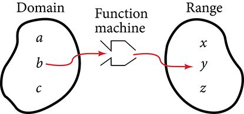
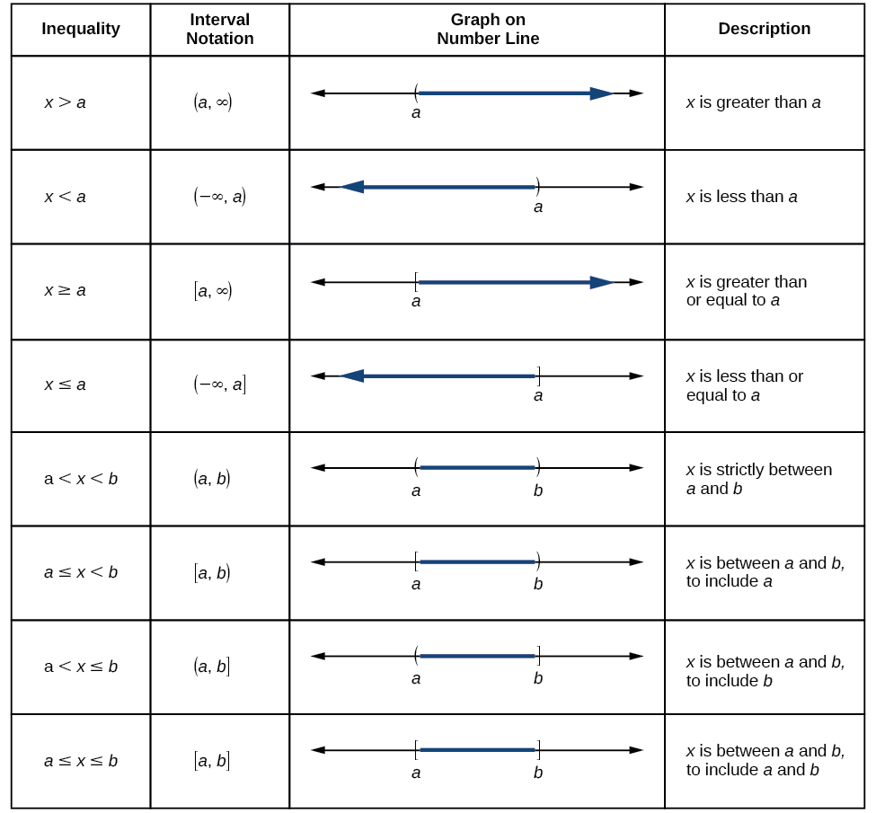
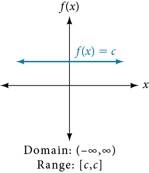
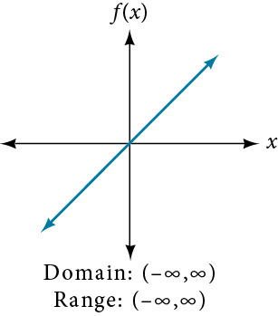
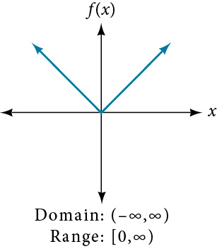
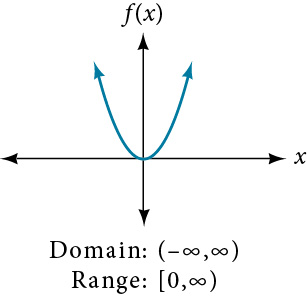
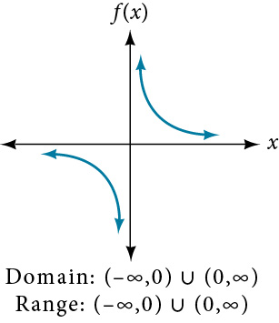
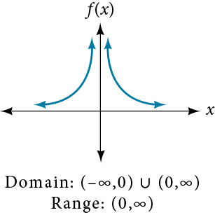
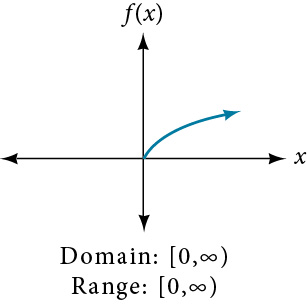
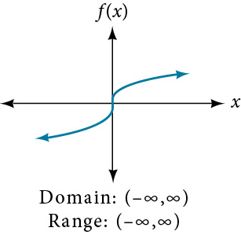

## 3.2: Domain and Range
### Finding the Domain of a Function Defined by an Equation
- When determining domain and range, need to consider what is physically possible and meaningful in the real world, along with what is mathematically permitted
- The domain can be considered a holding area that contains "raw materials" for the function, and the range is the holding area for the function's outputs
- 
- Domain and range can be written in **interval notation**, which are values in brackets to describe a set of numbers
  - The square bracket, `[`, is used when the set includes the endpoint and a parenthesis, `(` is used when the set does not include the endpoint (or that the interval is unbounded)
  - Interval notation conventions
    - Smallest number from the interval is written first
    - Largest number is written second, following a comma
    - Parentheses, `(` or `)`, are used to signify that the endpoint is not included (called exclusive)
    - Brackets, `[` or `]`, are used to indicate than an endpoint value is included (called inclusive)
  - 
- Finding the domain of a function whose equation is provided often involves remembering three different forms
  1. If the function has no denominator, the domain could be all real numbers
  2. If there is a denominator, exclude values in the domain that make the denominator zero
  3. If there is an even root, exclude values that would make the radicand negative
##### How To
- Given a function written in equation form, find the domain
  1. Identify the input values
  2. Identify any restrictions on the input and exclude those values from the domain
  3. Write the domain in interval form, if possible
##### How To
- Given a function written in an equation form that includes a fraction, find the domain
  1. Identify the input values
  2. Identify any restrictions on the input. If there is a denominator in the function's formula, set the denominator equal to zero and solve for x. If the function's formula contains an even root, set the radicand greater than or equal to 0, then solve.
  3. Write the domain in interval form, making sure to exclude any restricted values from the domain
##### How To
- Given a function written in equation form including an even root, find the domain
  1. Identify the input values
  2. Since there is an even root, exclude any real numbers that result in a negative number in the radicand. Set the radicand greater than or equal to zero and solve for x
  3. The solution(s) are the domain of the function. If possible, write the answer in interval form

### Using Notations to Specify Domain and Range
- In addition to using inequalities and lists to describe domains of functions, you can use inequalities and other statements to describe sets of values, such as **set-builder notation**. An example is $\{x|10 \leq x \lt 30\}$
  - The braces are read as "the set of" and the vertical bar is "such that"
- You can use the union symbol $\cup$ to combine two unconnected intervals
##### Set-builder Notation and Interval Notation
- **Set-builder notation** is a method of specifying a set of elements that satisfy a certain condition, such as $\{x | 4 \lt x \leq 12\}$
- **Interval notation** is a way of describing sets that include all real numbers between a lower limit (that may or may not be included) and an upper limit (that may or may not be included). A square bracket indicates inclusion in the set, and a parenthesis indicates exclusion
##### How To
- Given a line graph, describe the set of values using interval notation
  1. Identify the intervals to be included in the set by determining where the heavy line overlays the real line
  2. At the left end of each interval, use `[` with each end value to be included in the set (solid dot) or `(` for each excluded end value (open dot)
  3. At the right end of each interval, use `]` with each end value to be included in the set (solid dot) or `)` for each excluded end value (open dot)
  4. Use the union symbol $\cup$ to combine all intervals into one set

### Finding Domain and Range from Graphs
- You can also identify domain and range of functions by using graphs. Because the domain is the set of possible input values, the domain of a graph includes all input values shown on the x-axis. The range is the set of possible output values, shown on the y-axis. Remember that domain and range may be greater than visible values
- 
  - In this example, the domain is $[-5, \infty)$ and the range is $(-\infty, 5]$

### Finding Domains and Ranges of the Toolkit Functions
#### Constant Function
- 
#### Identity Function
- 
#### Absolute Value Function
- 
#### Quadratic Function
- 
#### Cubic Function
- 
#### Reciprocal Function
- 
#### Reciprocal Squared Function
- 
#### Square Root Function
- 
#### Cube Root Function
- 
##### How To
- Given the formula for a function, determine the domain and range
  1. Exclude from the domain any input values that result in division by zero
  2. Exclude from the domain any input values that have nonreal (or undefined) number outputs
  3. Use the value input values to determine the range of the output values
  4. Look at the function graph and table values to confirm the actual function behavior

### Graphing Piecewise-Defined Functions
- Sometimes functions require more than one formula to obtain a given output. The absolute value function is an example of a piecewise function. A **piecewise function** is a function in which more than one formula is used to define the output over different pieces of the domain. Tax brackets are an example of piecewise functions
##### Piecewise Function
- A **piecewise function** is a function in which more than one formula is used to define the output. Each formula has its own domain, and the domain of the function is the union of all these smaller domains
- In piecewise notation, the absolute value function is below
- $$ |x| = 
  \begin{cases}
  x & \text{if } x \ge 0,\\
  -x & \text{if } x < 0
  \end{cases}
  $$
##### How To
- Given a piecewise function, write the formula and identify the domain for each interval
  1. Identify the intervals for which different rules apply
  2. Determine the formulas that describe how to calculate an output from an input in each variable
  3. Use braces and if-statements to write the function

---
In-class notes
- Non-linear inequalities
- $3x = 15$
  - $x = \frac{15}{3}$
  - $x = 5$
  - Write the answer in interval notation: $x = \{5\}$ (the braces mean a "discrete point")
- $3x \lt -15$
  - $x \lt -\frac{15}{3}$
  - $x \lt -5$
  - Write the answer in interval notation: $x = (-\infty, -5)$
- $-3x \leq 15$
  - $x \geq -\frac{15}{3}$
  - $x \geq -5$
  - Write the answer in interval notation: $x = [-5, \infty)$
- $-\frac{1}{3} \gt 15$
  - Multiply by the reciprocal
  - $(-3)-\frac{1}{3} \lt 15(-3)$
  - $x \lt 45$
  - Write in interval notation: x = (-\infty, -45)
- $\frac{x}{2} \lt 2$
  - Multiply by the reciprocal
  - $$
- When a variable is in the denominator, **DO NOT MULTIPLY** by its reciprocal in rational inequalities
  - Get zero on one size
  - $\frac{3}{x} \lt 6$
  - $\frac{3}{x} - 6 \lt 0$
  - $\frac{3}{x} - \frac{6x}{1x} \lt 0$
  - $\frac{3 - 6x}{x} \lt 0$
  - Then analyze when the left size is < 0, which means negative
  - Factor completely numerator and denominator
- $\frac{(x - 2)(x + 5)}{x(x - 4)(x + 7)} \geq 0$
  - Draw a number line and plot the numbers where $x$ is equal to zero for each of the factors
  - Remember that the denominator can never be equal to zero
  - Pick a number from each area on the number line and determine whether it produces a negative or positive number
- $\frac{x}{2} - \frac{5}{x + 1} - 4 \lt 0$
  - When you have an inequality with a variable in the denominator, you do not clear the variable from the denominator, instead you find the LCD
  - Find the LCD: $2(x + 1)$
  - $\frac{(x + 1)}{(x + 1)}\frac{x}{2} - $
  - $\frac{x(x + 1) - 10 - 8(x + 1)}{2(x + 1)} \lt 0$
  - $\frac{x^2 - 1 - 10 - 8x - 8}{2(x + 1)} \lt 0$
  - \frac{x^2 - 7x - 18}{2(x + 1)} \lt 0
  - $\frac{(x - 9)(x + 2)}{2(x + 1)} \lt 0$
  - Draw the number line and plot the points for each factor that contains a variable, in this instance, $x = 9, x = -2, x = -1$
    - Choose numbers from each interval to test your inequality
  - If the inequality is not equal to zero, then all of your intervals are "open"
- If there is no variable in the denominator, it is a linear equation, so you can clear the variable
- $\frac{1}{r} + \frac{1}{1 - r} = \frac{4}{r^2}$
- **Domain** is the difference between the minimum and the maximum value of x
  - Domain is the width of the picture frame
- **Range** is the difference between the minimum and the maximum value of y
  - Range is the height of the picture frame
- Domain and range exist to indicate to show what you can use for your independent variable and what you will get as a result for your dependent variable
- **Parent function** has just `x`, no transformations
  - For example, the parent function of radical functions is $y = \sqrt{x}$
- To help graph a function, you can create a T table and start plugging in numbers

| $x$ | $y = \sqrt{x}$ |
|-----|----------------|
| 0   | 0              |
| 1   | 1              |
| 4   | 2              |
| 9   | 3              |

- $y = 3x + 5$
  - For linear functions, `x` can be all real numbers, $x = (-\infty, \infty) = \mathbb{R}$
- $y = x^2 - 3x + 7$
  - For quadratic functions, `x` can be all real numbers, $x = (-\infty, \infty) = \mathbb{R}$
- $y = \sqrt{x - 1} + 2$
  - For an even root, you need to be on alert
  - Under the radical, you must require non-negative numbers
- $y = \sqrt[3]{x - 1}$
  - For an odd root, `x` can be all real numbers, $(-\infty, \infty)$
- $y = \frac{1}{x^2 - 5x + 4}$
  - You must have a non-zero denominator
  - Factor the denominator, and check for the values where x ends up becoming zero
- $y = \frac{1}{\sqrt{x^2 - 5x + 4}}$
- $y = \frac{2}{\sqrt[3]{x^2 - 5x + 4}}$
  - $x^2 - 5x + 4 \ne 0$
  - $(x - 4)(x - 1) \ne 0$
  - $x \ne 4; x \ne 1$
- $y = \frac{3}{x - 5}$
  - For this rational function, we cannot have $x - 5 = 0; x = 5$
  - $x \gt 5 \cup x \lt 5$
  - $(-\infty, 5)\cup(5, \infty)$
- For domain, what are the set of good `x` values that I can use where I will never have any trouble?
  - Domain is more easily findable than range, domain can typically be determined from the function