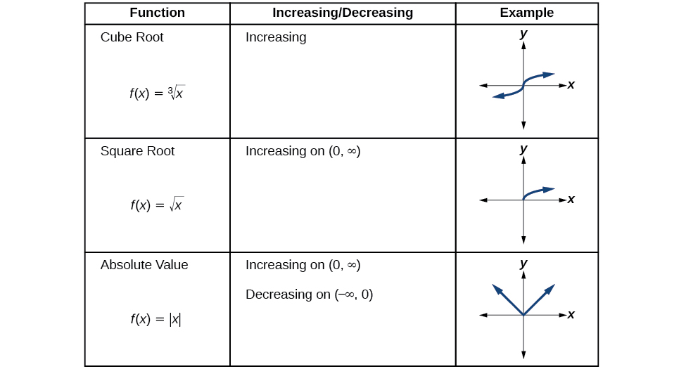

## 3.3 Rates of Change and Behavior of Graphs
### Finding the Average Rate of Change of a Function
- The **rate of change** describes how an output quantity changes relative to the change in the input quantity. If we use only the beginning and ending data, we are finding the **average rate of change** over a specified time. To find this rate of change, divide the change in the output value by the change in the input value.
  - $\text{Average rate of change} = \frac{\text{Change in output}}{\text{Change in input}}$
    - $= \frac{\Delta{y}}{\Delta{x}}$
    - $= \frac{y_2 - y_1}{x_2 - x_1}$
- The greek letter $\Delta$ (delta) is used to signify the change in quantity
##### Rate of Change
- A rate of change describes how an output quantity changes relative to the change in the input quantity. The units on a rate of change are "output units per input units"
- The average rate of change between two input values is the total change of the function values (output values) divided by the change in the input values
  - $\frac{\Delta y}{\Delta x} = \frac{f(x_2) - f(x_1)}{x_2 - x_1}$
##### How To
- Given the value of a function at different points, calculate the average rate of change of a function for the interval between two values $x_1$ and $x_2$
  1. Calculate the difference $y_2 - y_1 = \Delta y$
  2. Calculate the difference $x_2 - x_1 = \Delta x$
  3. Find the ratio $\frac{\Delta y}{\Delta x}$

### Using a Graph to Determine Where a Function is Increasing, Decreasing, or Constant
- As a part of how functions change, we can identify intervals where the function is changing in specific ways, such as increasing, decreasing, or constant
- A function is increasing on an interval if the function values increase as the input values increase within that interval
  - The average rate of change is positive
- A function is decreasing on an interval if the function values decrease as the input values increase within that interval
  - The average rate of change is negative
- Some functions are increasing/decreasing over their entire domain, while others do not
- A value of the input where a function changes from increasing to decreasing is the location of a **local maximum**, if a function has more than one of these points, it has **local maxima**.
- In the same way, where a function changes from decreasing to increasing is a **local minimum**, with multiple being called **local minima**.
- To locate the local maxima and minima from a graph, we need to observe where the graph has its lowest and highest points
##### Local Minima and Local Maxima
- A function $f$ is an **increasing function** on an open interval if $f(b) \gt f(a)$ for any two input values $a$ and $b$ in the given interval where $b \gt a$
- A function $f$ is a **decreasing function** on an open interval if $f(b) \lt f(a)$ for any two input values $a$ and $b$ in the given interval where $b \gt a$
- A function $f$ has a local maximum at $x = b$ if there exists an interval $(a, c)$ with $a \lt b \lt c$ such that, for any $x$ in the interval $(a, c), f(x) \leq f(b)$. Likewise, $f$ has a local minimum at $x = b$ if there exists an interval $(a, c)$ with $a \lt b \lt c$ such that, for any $x$ in the interval $(a, c)$, $f(x) \geq f(b)$

### Analyzing the Toolkit Functions for Increasing or Decreasing Intervals
- 
- 
- 

### Use a Graph to Locate the Absolute Maximum and Absolute Minimum
- The y-coordinates (output) of the highest and lowest points on the entire graph are called the **absolute maximum** and **absolute minimum**. Note that not every function has these.
##### Absolute Maxima and Minima
- The **absolute maximum** of $f$ at $x = c$ is $f(c)$ where $f(c) \geq f(x)$ for all $x$ in the domain of $f$.
- The **absolute minimum** of $f$ at $x = d$ is $f(d)$ where $f(d) \leq f(x)$ for all $x$ in the domain of $f$.

---
In-class notes
- Rate of change is how fast your `y` value 
- **Rate of change** = $\frac{\text{change in y}}{\text{change in x}}$
  - Slope represents the rate of change, also called the difference quotient
- **difference quotient** = $\frac{f(x) - f(a)}{x - a}$
  - $\frac{f(x + h) - f(x)}{h}$
- If you have `a` for your independent variable, then your dependent variable is `f(a)`
- $f(x) = \frac{x - 3}{2x + 1}$
  - $f(x + h) = \frac{x + h - 3}{2(x + h) + 1}$
- For finding derivative
  - Name the denominator $h(2x + 2h + 1)(2x + 1)$
  - Then cross-multiply $(x + h - 3)(2x + 1) - (x - 3)(2x + 2h + 1)$
  - $\frac{2x^2 + x + 2xh + h - 6x - 3 - 2x^2 - 2xh - x + 6x + 6xh + 3}{h(2x + 2h + 1)(2x + 1)}$
  - All terms involving only x will disappear, only terms with h will stay
  - $\frac{7h}{h(2x + 2h + 1)(2x + 1)} = \frac{7}{(2x + 2h + 1)(2x + 1)}$
- $y = \sqrt{x - 3}$
- $f(x) = \sqrt{x - 3}$
- $f(a) = \sqrt{x - 3}$
- $\frac{\sqrt{x - 3} - \sqrt{a - 3}}{x - a}$
  - Multiply top and bottom by the conjugate
    - $\sqrt{x - 3} + \sqrt{a - 3}$