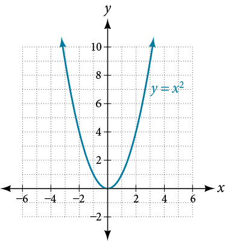
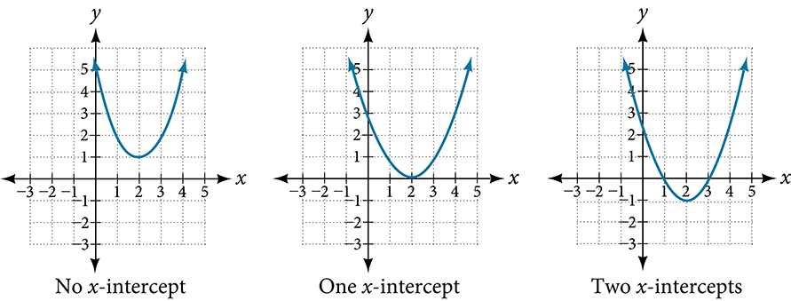

## 5.1: Quadratic Functions

### Recognizing Characteristics of Parabolas
- The graph of a quadratic equation is a U-shaped curve called a parabola. It has an extreme point, called the **vertex**.
  - If the parabola opens upward, the vertex is the lowest point on the graph (or the minimum value of the quadratic function)
  - If the parabola opens downward, the vertex is the highest point on the graph (or the maximum value of the quadratic function)
- The graph of a quadratic function is symmetric with a vertical line that goes through the vertex, called the **axis of symmetry**
- The y-intercept is the point at which the parabola crosses the y-axis and the x-intercepts (plural) are the points where the parabola crosses the x-axis. If x-intercepts exist, they represent the **zeros** or **roots** of the quadratic function, the values of x at which y = 0
- 
### Understanding How the Graphs of Parabolas are Related to Their Quadratic Functions
- **General form of a quadratic function**: $f(x) = ax^2 + bx + c$
  - $a$, $b$, and $c$ are real numbers and $a \ne 0$
  - If $a \gt 0$, then the parabola opens upward
  - If $a \lt 0$, then the parabola opens downward
- The axis of symmetry is defined by $x = -\frac{b}{2a}$ and the vertex always occurs along the axis of symmetry
  - This is derived from the quadratic formula
- **Standard form of a quadratic function**: $f(x) = a(x - h)^2 + k$
  - $(h, k)$ is the vertex of the parabola
  - This form is also called the **vertex form of a quadratic function**
  - Similar to the general for, if $a \gt 0$, then the parabola opens upward and the vertex is a minimum
  - If $a \lt 0$, then the parabola opens downward and the vertex is a maximum
  - 
  - This example represents the graph of the equation $y = -3(x + 2)^2 + 4$
- $y = x^2$
  - 
- If $k \gt 0$, then the graph shifts upward, if $k \lt 0$, then the graph shifts downward
- If $h \gt 0$, then the graph shifts towards the right, if $h \lt 0$, then the graph shifts to the left
- Magnitude of $a$ indicates the stretch of the graph, if $|a| \gt 1$ the point associated with a particular x value shifts farther from the x-axis, but if $|a| \lt 1$, then the point shifts closer to the x-axis
- Standard form and general form describe the same function
##### Forms of Quadratic Functions
- Quadratic function is a polynomial function of degree two and its graph is a parabola
- The **general form of a quadratic function** is $f(x) = ax^2 + bx + c$ where $a$, $b$, and $c$ are real numbers and $a \ne 0$
- The **standard form of a quadratic function** is $f(x) = a(x - h)^2 + k$ where $a \ne 0$. The vertex $(h, k)$ is located at $h = -\frac{b}{2a}$
##### How To
- Given a graph of a quadratic function, write the equation of the function in general form
  1. Identify the horizontal shift of the parabola; this value is $h$. Identify the vertical shift of the parabola; this value is $k$
  2. Substitute the values of the horizontal and vertical shift for $h$ and $k$ in the function $f(x) = a(x - h)^2 + k$
  3. Substitute the values of any point, other than the vertex, on the graph of the parabola for $x$ and $f(x)$
  4. Solve for the stretch factor, $|a|$
  5. Expand and simplify to write in general form
##### Examples
##### How To
- Given a quadratic function in general form, find the vertex of the parabola
  1. Identify $a$, $b$, and $c$
  2. Find $h$, the x-coordinate of the vertex by substituting $a$ and $b$ into $h = -\frac{b}{2a}$
  3. Find $k$, the y-coordinate of the vertex, by evaluating $k = f(h) = f(-\frac{b}{2a})$

### Finding the Domain and Range of a Quadratic Function
- Any number can be an input value of a quadratic function, which means that the domain of any quadratic function is all real numbers.
- Because parabolas have a maximum or a minimum point, the range is restricted. Depending on whether the parabola opens up or down, the range will be all values greater/less than the turning point
##### Domain and Range of a Quadratic Function
- Domain of any quadratic function is all real numbers (unless the context presents some restrictions)
- Range of a quadratic function in general form $f(x) = ax^2 + bx + c$ with a positive $a$ value is $f(x) \geq f(-\frac{b}{2a})$ or $[f(-\frac{b}{2a}), \infty)$, with a negative $a$ value $f(x) \leq f(-\frac{b}{2a})$ or $(-\infty, f(-\frac{b}{2a})]$
- Range of a quadratic function in standard form $f(x) = a(x - h)^2 + k$ with a positive $a$ value is $f(x) \geq k$, with a negative $a$ value is $f(x) \leq k$
##### How To
- Given a quadratic function, find the domain and range
  1. Identify the domain of any quadratic function as all real numbers
  2. Determine whether $a$ is positive or negative. If $a$ is positive, the parabola has a minimum, if $a$ is negative, the parabola has a maximum
  3. Determine the maximum or minimum value of the parabola, $k$
  4. If the parabola has a minimum, the range is given by $f(x) \geq k$, or $[k, \infty)$. If the parabola has a maximum, the range is given by $f(x) \leq k$, or $(-\infty, k]$

### Determining the Maximum and Minimum Values of Quadratic Functions
- The output of the quadratic function at the vertex is the maximum/minimum (depending on orientation)
#### Finding the x- and y-intercepts of a Quadratic Function
- The y-intercept of a quadratic is found by evaluating the function at an input of 0
- The x-intercepts of a quadratic is found by evaluating where the output is 0
  - There may be 0, 1, or 2 x-intercepts
  - 
##### How To
- Given a quadratic function $f(x)$, find the y and x intercepts
  1. Evaluate $f(0)$ to find the y-intercept
  2. Solve the quadratic equation $f(x) = 0$ to find the x-intercepts
#### Rewriting Quadratics in Standard Form
- For some quadratics, they can be easily solved by factoring, others cannot. For these, we need to rewrite them in standard form
##### How To
- Given a quadratic function, find the x-intercepts by rewriting in standard form
  1. Substitute $a$ and $b$ into $h = -\frac{b}{2a}$
  2. Substitute $x = h$ into the general form of the quadratic function to find $k$
  3. Rewrite the quadratic in standard form using $h$ and $k$
  4. Solve for when the output of the function will be zero to find the x-intercepts

---
In-class Notes
- Links
  - [Standard form](#standard_form)
- Generally speaking, polynomial functions look like
- $y = f(x) = p(x) = a_nx^n + a_{n - 1}x^{n - 1} + a_{n - 2}x^{n - 2} + ... + a_2x^2 + a_1x^1 + a_0$
- $y = 3x^7 - 5x^6 + 2x^3 - 9x + 6$
  - The highest degree signifies the direction the branches of the graphs go
  - $a_n$ is the number with the highest degree next to x
  - In our example about $a_7 = 3$, since this is leading coefficient is positive/greater than 0 and the highest degree is odd, the left hand side of the graph points down and the right side points up
  - $a_6 = -5; a_5 = 0; a_4 = 0; a_3 = 2; a_2 = 0; a_1 = -9, a_0 = 6$
- Important points
  - y-intercept: easy to find, set x = 0 and solve, in this instance $(0, 6)$
  - x-intercept: set y = 0 and solve; you should have one solution for each degree of the function, in this instance 7
    - Some of them can be complex numbers, and some can be repeating, and some will be rational numbers
## Quadratic Functions
- Parabola is the graph of a quadratic function
  - $y = ax^2 + bx + c$
  - Important points in quadratic functions
    - Axis of symmetry, all quadratic functions have this, where 
    - Vertex: vertex is one of the points (minimum/"saddle" or maximum/"summit") through which the axis of symmetry passes
      - vertex $x = -\frac{b}{2a}$
      - Has special notation: $(h, k)$
- Graphing any quadratic function
  - $y = -3x^2 - 5x + 2$
  1. Identify $a$, use the template $y = ax^2 + bx + c$
     - $a = -3$ so the graph opens downward
  2. Find y-intercept, set x = 0
     - $y = -3(0)^2 - 5(0) + 2; y = 2$
     - $(0, 2)$
  3. Find x-intercept, set y = 0
     - $-3x^2 - 5x + 2 = 0$
     - $3x^5 + 5x - 2 = 0$
     - $(3x - 1)(x + 2) = 0$
     - $x = \frac{1}{3}; x = -2$
  4. Find the vertex
     - $h = x = -\frac{b}{2a} = -\frac{-5}{2(-3)} = -\frac{5}{6}$
     - $h = \frac{x_1 + x_2}{2} = \frac{-2 + \frac{1}{3}}{2} = -\frac{5}{6}$
     - $k = y$
       - Plug your $h$ value into the original equation
       - $k = -3(-\frac{5}{6})^2 - 5(-\frac{5}{6}) + 2$
       - $= -\frac{25}{12} + \frac{25}{6} + 2$
       - $= \frac{-25 + 50 + 24}{12} = \frac{49}{12} = 4\frac{1}{12}$
     - **THE FIRST NUMBER IS ALWAYS HALF OF THE SECOND NUMBER OF THE VERTEX AND THEY HAVE OPPOSITE SIGNS**
  5. Find axis of symmetry
     - $x = -\frac{5}{6}$
  6. Find domain and range
     - For any quadratic function, range is all real numbers
     - Range = $(-\infty, \infty)$
     - Domain = $(-\infty, 4\frac{1}{12}]$
- $y = \frac{2}{5}x^2 - x + 3$
  1. Identify $a$, $b$, and $c$
     - $a = \frac{2}{5}$
       - Because $a \gt 0$, the arms of the parabolas go up
     - $b = -1$
     - $c = 3$
  2. Find y-int; set x = 0
     - $y = 3$
  3. Find x-int; set y = 0
     - $\frac{2}{5}x^2 - x + 3 = 0$
     - $5\cdot\frac{2}{5}x^2 - x\cdot5 + 3\cdot5 = 0\cdot5$
     - $2x^2 - 5x + 15 = 0$ now $a = 2$, $b = -5$, $c = 15$
     - $x = \frac{-(-5)^2 \pm \sqrt{(-5)^2 - 4 \cdot 2 \cdot 15}}{2 \cdot 2}$
     - $x = \frac{5 \pm i\sqrt{95}}{4}$
     - Solutions are complex numbers, which means that you do not cross the x-axis
  4. Find vertex
     - $h = x = \frac{-b}{2a} = \frac{-(-1)}{2\cdot\frac{2}{5}} = \frac{1}{\frac{4}{5}} = \frac{5}{4}$
     - $k = y = \frac{2}{5}(\frac{5}{4})^2 - (\frac{5}{4}) + 3$
     - $\frac{5}{8} - \frac{5}{4} + 3$ - verify that the first number is half of the second and has an opposite sign
     - $\frac{5 - 10 + 14}{8} = \frac{19}{8} = 2\frac{3}{8}$
     - $(h, k) = (\frac{5}{4}, 2\frac{3}{8})$
  5. Axis of symmetry
     - $x = \frac{5}{4} = h$
  6. Find domain and range
     - Domain = $(-\infty, \infty)$
     - Range = $[2\frac{3}{8}, \infty)$
- **FOR QUADRATIC FUNCTIONS ONLY, YOU ARE LOOKING FOR THE VERTEX**
- If your quadratic function is not written in standard form
  - $y = -2(x - 5)^2 + 4$
    - **"Vertex form function"**
    - General form: $y = a(x - h)^2 - k$
    - You have the vertex explicitly provided to you $(h, k)$, which is $(5, 4)$ in this example
      - Remember that $h$ is the opposite of what you have in the vertex form formula
    - You need to find the y-intercept (let x=0)
      - $y = -2(0 - 5)^2 + 4$
      - $y = -50 + 4$
      - $(0, -46)$
    - You need to find the x-intercept (let y=0)
      - $-2(x - 5)^2 = -4$
      - $(x - 5)^2 = 2$
      - $\sqrt{(x - 5^2)} = \sqrt{2}$
      - $x - 5 = \pm \sqrt{2}$
      - $x = 5 \pm \sqrt{2}$
    - You need to find the domain and range
      - Domain: $x = (-\infty, \infty)$
      - Range: $y = (-\infty, 4]$
  - $y = -\frac{1}{2}(x + 3)(x - 1)$
    - **"Factored form"**
    - General form: $y = a(x - x_1)(x - x_2)$
    - You have x-intercepts explicitly given to you, in this example, $x = -3$ and $x = 1$
    - You need to find the y-intercept, let x=0
      - $y = -\frac{1}{2}(0 + 3)(0 - 1)$
      - $y = -\frac{1}{2}(3)(-1)$
      - $y = \frac{3}{2}$
    - You need to find the vertex
      - $h = \frac{x_1 + x_2}{2} = \frac{-3 + 1}{2} = -1$
      - To get $k$, plug in $h$ into the original function
      - $y = -\frac{1}{2}(-1 + 3)(-1 - 1) = 2$
      - $(h, k) = (-1, 2)$
    - Domain: All real numbers
    - Range: $(-\infty, 2]$
  - $y = 3x^2 - x - 2$
    - <a name="standard_form">**"Standard form"**</a>
    - General form: $y = ax^2 + bx + c$
    - This has no explicit info about the graph, except for the y-intercept $(0, c)$
    - You must find the vertex, $(h, k)$, and x-intercept
    - To find the x-intercepts, either factor or use the quadratic equation
## Polynomial Functions
- $y = x^4 - 3x^2 - 4$
  - "Standard form"
  - Determine $n$, which in this example is $n = 4$
  - $a = 1$, so graph opens upward
  - Find y-intercept, let x=0
    - $y = -4$, so $(0, -4)$
  - Find x-intercept, let y=0
    - $x^4 - 3x^2 - 4 = 0$
    - Can use substitution here, so $p = x^2$
    - $p^2 - 3p - 4 = 0$
    - $(p - 4)(p + 1) = 0$
    - $p = 4; p = -1$
    - $x^2 = 4; x^2 = -1$
    - $x = \pm2$
    - $x = \pm i$
- $y = -5(x - 3)(x + 2)(x - 1)$
  - "Factored form"
  - Entire process of polynomial functions is to get to factored form
  - Neither $n$ nor $a$ are given to you
  - For $n$, "how many x's are in the parentheses?"
    - $n = 3$
  - For $a$, take the first number is the leading coefficient and multiply it by numbers next to x
  - y-intercept, let x = 0
    - $y = -5(0 - 3)(0 + 2)(-1) = -3$
- $y = x^3 - x^2 - 3x + 3$
  - $n = 3$
  - $a = 1$
  - y-intercept = $(0, 3)$
  - Factor by grouping
    - $(x^3 - x^2)(-3x + 3)$
    - $y = x^2(x - 1)-3(x - 1)$
    - $y = (x^2 - 3)(x - 1)$
    - $x = 1; x = \pm\sqrt{3}$
    - 
- $y = 3(5 - x)(4 - x)^4x^3(1 - 2x)$
  - $n = 9$
  - $a = (3 \cdot -1 \cdot (-1)^4 \cdot 1 \cdot (-2)) = 6$
- $y = 2(x - 3)(x + 2)(x - 1)^2x$
  - n = 5
  - a = 2
  - y-intercept =
  - **IF MULTIPLICITY IS 2 (EVEN, OR 4, 6, ETC.), YOU JUST TOUCH THE X-AXIS AND "BOUNCE BACK" AT THAT PARTICULAR POINT**
    - $x = 3; x = -2; x = 1 (\text{multiplicity }2); x = 0$
  - **IF MULTIPLICITY IS 3 (ODD, OR 5, 7, ETC.), YOU PASS THROUGH THE POINT ON THE X-AXIS**
- $y = -2(3 - x)(4 - x)^2x^3(x^2 - 1)$
  - $n = 8$
  - $x = 3; x = 4; x = 0 (\text{multiplicity }3); x = \pm 1$
- $y = 3(5 - x)(4 - x)^4x^3(1 - 2x)$
  - $x = 5; x = 4 (\text{multiplicity }4); x = 0 (\text{multiplicity }3); x = \frac{1}{2}$
- For odd degree polynomials, the range is all real numbers
- "Describe end behavior"
  - What happens when x goes to $\infty$ and $-\infty$?