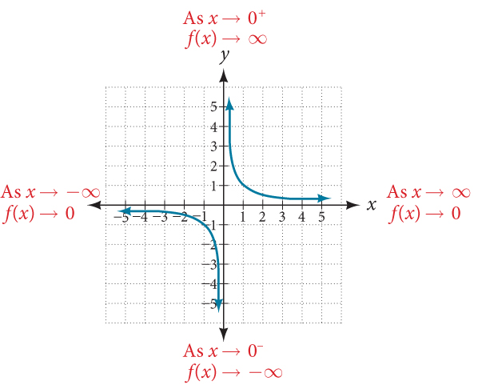
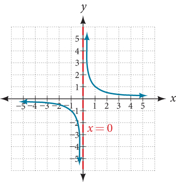
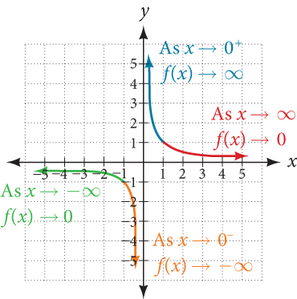
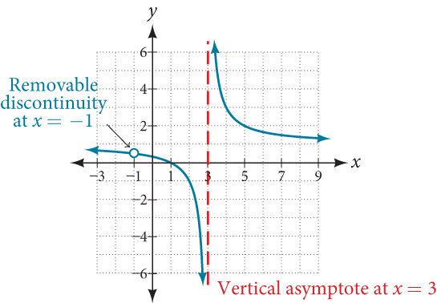
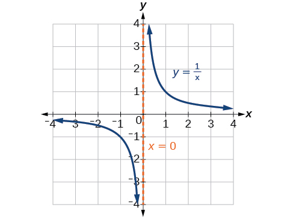
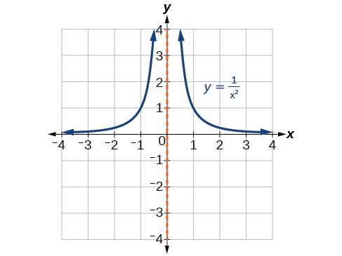

## 5.6: Rational Functions
### Using Arrow Notation
- We use **arrow notation** to show that $x$ or $f(x)$ is approaching a particular value

| **Symbol**            | **Meaning**                                                                  |
|-----------------------|------------------------------------------------------------------------------|
| $x \to a^-$           | $x$ approaches $a$ from the left ($x < a$ but close to $a$)                  |
| $x \to a^+$           | $x$ approaches $a$ from the right ($x > a$ but close to $a$)                 |
| $x \to \infty$        | $x$ approaches infinity ($x$ increases without bound)                        |
| $x \to -\infty$       | $x$ approaches negative infinity ($x$ decreases without bound)               |
| $f(x) \to \infty$     | the output approaches infinity (the output increases without bound)          |
| $f(x) \to -\infty$    | the output approaches negative infinity (the output decreases without bound) |
| $f(x) \to a$          | the output approaches $a$                                                    |
#### Local Behavior of $f(x) = \frac{1}{x}$
- For the reciprocal function $f(x) = \frac{1}{x}$, we cannot divide by zero, meaning the function is undefined at $x = 0$, so zero is not in the domain

| $x$                  | $-0.1$ | $-0.01$ | $-0.001$ | $-0.0001$   |
|----------------------|--------|---------|----------|-------------|
| $f(x) = \frac{1}{x}$ | $-10$  | $-100$  | $-1000$  | $-10{,}000$ |
- As $x$ approaches zero from the left, the function values decrease without bound (approach negative infinity)
- In arrow notation: $x \to 0^-, f(x) \to -\infty$
- As $x$ approaches zero from the right, the function values increase without bound (approaching infinity)

| $x$                  | $0.1$ | $0.01$ | $0.001$ | $0.0001$   |
|----------------------|-------|--------|---------|------------|
| $f(x) = \frac{1}{x}$ | $10$  | $100$  | $1000$  | $10{,}000$ |
- In arrow notation: $x \to 0^+, f(x) \to \infty$
- 
- This behavior creates a **vertical asymptote**, which is a vertical line that the graph approaches but never crosses
- 
##### Vertical Asymptote
- A **vertical asymptote** of a graph is a vertical line $x = a$ where the graph tends toward positive or negative infinity as the input approaches $a$ from either the left or the right.
- $\text{As } x \to a^-, f(x) \to \pm \infty \text{ or } x \to a^+, f(x) \to \pm \infty$
#### End Behavior of $f(x) \frac{1}{x}$
- As the values of $x$ approach infinity, the function value approaches 0 and as values of $x$ approach negative infinity, the function values approach 0
- In arrow notation, this is $\text{As } x \to \infty, f(x) \to 0, \text{ and as } x \to -\infty, f(x) \to 0$
- 
- The function approaches zero, but it never actually reaches it, leveling off as the inputs become large. This creates a **horizontal asymptote**, which is a horizontal line that the graph approaches as the input increases or decreases without bound
##### Horizontal Asymptote
- A **horizontal asymptote** of a graph is a horizontal line $y = b$ where the graph approaches the line as the inputs increase or decrease without bound.
- $\text{As } x \to \infty \text{ or } x \to -\infty, f(x) \to b$
### Solving Applied Problems Involving Rational Functions
- A **rational function** is a function that can be written as the quotient of two polynomial functions
##### Rational Function
- A **rational function** is a function that can be written as the quotient of two polynomial functions $P(x)$ and $Q(x)$
- $f(x) = \frac{P(x)}{Q(x)} = \frac{a_px^p + a_{p-1}x^{p-1} + ... + a_1x + a_0}{b_qx^q + b_{q-1}x^{q-1} + ... + b_1x + b_0}, Q(x) \ne 0$
### Finding the Domain of Rational Functions
- The vertical asymptote is a value at which a rational function is undefined, so that value is not in the domain of the function.
- A reciprocal function cannot have values in its domain that cause the denominator to equal zero, so we need to determine which inputs cause division by zero
##### Domain of a Rational Function
- The domain of a rational function includes all real numbers except those that cause the denominator to equal zero
##### How To
- Given a rational function, find the domain
  1. Set the denominator equal to zero
  2. Solve to find the x-values that cause the denominator to equal zero
  3. The domain is all real numbers except those found in step 2
### Identifying Vertical Asymptotes of Rational Functions
- By looking at a graph of a rational function, we can easily see whether there are asymptotes and may be able to approximate their location. However, without the graph, we can still identify these asymptotes
#### Vertical Asymptotes
- Vertical asymptotes of a function may be found by examining the factors of the denominator that are not common to factors in the numerator.
- Vertical asymptotes occur at the zeros of these factors
##### How To
- Given a rational function, identify any vertical asymptotes of its graph
  1. Factor the numerator and denominator
  2. Note any restrictions in the domain of the function
  3. Reduce the expression by canceling common factors in the numerator and the denominator
  4. Note any values that cause the denominator to be zero in this simplified version. These are where vertical asymptotes occur
  5. Note any restrictions in the domain where asymptotes do not occur. These are removable discontinuities, or "holes"
#### Removable Discontinuities
- Occasionally, graphs contain a hole, which is a single point where the graph is undefined, and is indicated by an open circle. This is called a **removable discontinuity**
- For example, $f(x) = \frac{x^2 - 1}{x^2 - 2x - 3}$
  - Factored: $f(x) = \frac{(x + 1)(x - 1)}{(x + 1)(x - 3)}$
  - The common factor (x + 1) has a zero of $x = -1$, this is the location of a removable discontinuity
  - The factor (x - 3) is not a factor in both the denominator and numerator, so the zero $x = 3$ is a vertical asymptote
- 
##### Removable Discontinuities of Rational Functions
- A **removable discontinuity** occurs in the graph of a rational function at $x = a$ if $a$ is a zero for a factor in the denominator that is common with a factor in the numerator. We factor the denominator and numerator and check for common factors. If we find any, we set the common factor equal to zero and solve. This gives us the location of a removable discontinuity. This is true if the multiplicity of this factor is greater than or equal to that in the denominator. If the multiplicity of this factor is greater in the denominator, then there is still an asymptote at that value.
### Identifying Horizontal Asymptotes of Rational Functions
- Vertical asymptotes describe the behavior of the graph as the *output* gets very large or very small, horizontal asymptotes help describe the behavior of the graph as the *input* gets very large or very small.
- A rational function's end behavior will mirror that of the ratio of the function that is the ratio of the leading terms
- Three outcomes when checking for horizontal asymptotes
  - **Case 1**: If the degree of the denominator > degree of the numerator, there is a horizontal asymptote at $y = 0$
  - **Case 2**: If the degree of the denominator < degree of the numerator by one, we get a slant asymptote
    - To find the equation of the slant asymptote, divide the numerator by the denominator, the quotient is the equation of the slant asymptote (ignore remainder)
  - **Case 3**: If the degree of the denominator = degree of the numerator, there is a horizontal asymptote at $y = \frac{a_n}{b_n}$, where $a_n$ and $b_n$ are the leading coefficients of $p(x)$ and $q(x)$ for $f(x) = \frac{p(x)}{q(x)}, q(x) \ne 0$
- While the graph of a rational function will never cross a vertical asymptote, it may or may not cross a horizontal or slant asymptote.
- A graph of a rational function may have many vertical asymptotes, it will have at most one horizontal (or slant) asymptote
- If the degree of the numerator is larger than the degree of the denominator by more than one, the end behavior of the graph will mimic the behavior of the reduced end behavior function
##### Horizontal Asymptotes of Rational Functions
- The horizontal asymptote of a rational function can be determined by looking at the degrees of the numerator and denominator
  - Degree of numerator is less than degree of denominator: horizontal asymptote at $y = 0$
  - Degree of numerator is greater than degree of denominator by one: no horizontal asymptote; slant asymptote
  - Degree of numerator is equal to degree of denominator: horizontal asymptote at ratio of leading coefficients
### Graphing Rational Functions
- The vertical asymptotes associated with the factors of the denominator will mirror one of the two toolkit functions.
- When the degree of the factor in the denominator is odd, the distinguishing factor is that on one side of the vertical asymptote, the graph heads toward positive infinity, and on the other side the graph heads towards negative infinity
- 
- When the degree of the factor in the denominator is even, the distinguishing characteristic is that the graph either heads toward positive infinity on both sides of the vertical asymptote or heads toward negative infinity on both sides
- 
##### How To
- Given a rational function, sketch a graph
  1. Evaluate the function at 0 to find the y-intercept
  2. Factor the numerator and denominator
  3. For factors in the numerator but not common to the denominator, determine where each factor of the numerator is zero to find the x-intercepts
  4. Find the multiplicities of the x-intercepts to determine the behavior of the graph at those points
  5. For factors in the denominator, note the multiplicities of the zeros to determine the local behavior. For those factors not common to the numerator, find the vertical asymptotes by setting those factors equal to zero and then solve.
  6. For factors in the denominator common to factors in the numerator, find the removable discontinuities by setting those factors equal to 0 and then solve
  7. Compare the degrees of the numerator and denominator to determine the horizontal and slant asymptotes
  8. Sketch the graph
### Writing Rational Functions
- A rational function written in factored form will have an x-intercept where each factor of the numerator is equal to zero (exceptions for removable discontinuities)
- We can form a numerator of a function whose graph will pass through a set of x-intercepts by introducing a corresponding set of factors.
- Because the function will have a vertical asymptote where each factor of the denominator is equal to zero, we can form a denominator that will produce the vertical asymptotes by introducing a corresponding set of factors
##### How To
- Given a graph of a rational function, write the function
  1. Determine the factors of the numerator. Examine the behavior of the graph at the x-intercepts to determine the zeros and their multiplicities.
  2. Determine the factors of the denominator. Examine the behavior on both sides of each vertical asymptote to determine the factors and their powers
  3. Use any clear point on the graph to find the stretch factor